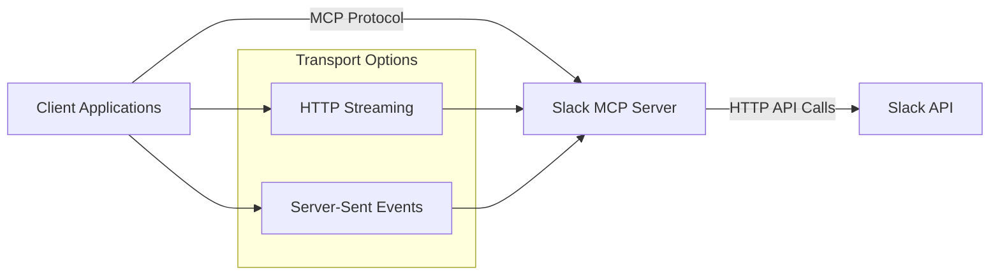
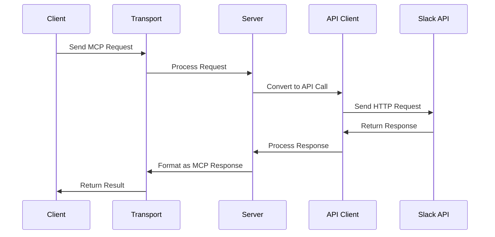

# Software Architecture

This document provides an overview of the Slack MCP Server architecture, its core components, and how they interact with each other.

## System Overview

Slack MCP Server is designed as a middleware layer between client applications and the Slack API. It implements a Model Context Protocol (MCP) pattern to provide a consistent interface regardless of the underlying transport mechanism. For more information about MCP, see the [official documentation](https://modelcontextprotocol.io/docs/getting-started/intro).

## Core Components

### Client Layer

The client layer provides interfaces for applications to communicate with the MCP server:

- **Transport Adapters**: Implementations for different communication protocols (HTTP streaming, SSE)
- **Client Libraries**: Language-specific libraries that implement the MCP protocol

### Server Layer

The server is the central component that:

1. Receives client requests via different transport mechanisms
2. Processes commands according to the MCP protocol
3. Communicates with the Slack API
4. Returns standardized responses to clients

### Domain Models

Domain models represent the core business entities from Slack:

- **SlackWorkspace**: Represents a Slack workspace/team
- **SlackChannel**: Represents a channel within a workspace
- **SlackMessage**: Represents a message within a channel
- **SlackThread**: Represents a thread within a channel
- **SlackUser**: Represents a user within a Slack workspace
- **SlackApp**: Represents an app or bot within Slack

## Transport Mechanisms

### HTTP Streaming

Long-lived HTTP connections that stream responses back to clients. Features:

- Simpler to implement on the client side
- Works with standard HTTP libraries
- Compatible with most network environments

### Server-Sent Events (SSE)

Event-based communication mechanism for real-time updates. Features:

- Native browser support
- Automatic reconnection
- Event-based programming model

## Data Flow

## Environment Configuration

The server supports configuration through:

- Command-line arguments
- Environment variables
- `.env` files with custom paths

Configuration is handled through a centralized configuration system that ensures consistency across all components.

## Security Model

- API tokens are securely managed and never exposed
- Token validation occurs before any API requests
- No persistent storage of tokens (loaded at runtime)
- Transport security relies on HTTPS/TLS

## Error Handling

- Standardized error responses across all transports
- Detailed error information for debugging
- Graceful degradation on API failures

## Extensibility

The architecture is designed to be extensible in several ways:

1. **New Transport Mechanisms**: Additional transport options can be added by implementing the Transport interface
2. **Additional API Resources**: New Slack API resources can be integrated by extending the domain models
3. **Custom Command Handlers**: Special-purpose commands can be added with custom handlers

## Design Patterns

The project uses several design patterns:

- **Factory Pattern**: For creating clients and server instances
- **Strategy Pattern**: For selecting transport mechanisms
- **Repository Pattern**: For data access abstraction
- **Command Pattern**: For handling MCP commands
- **Adapter Pattern**: For different transport implementations
