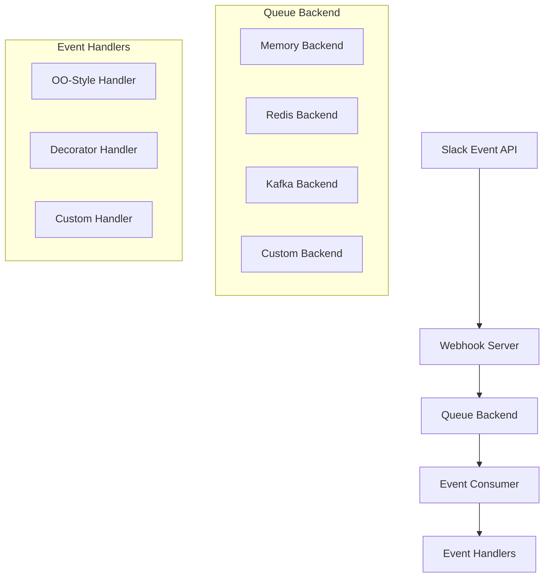

# Event Handler & Queue Architecture

This document provides comprehensive architectural coverage of the Slack MCP server's event handling system, including the queue-based architecture that decouples event reception from event processing, enabling scalable and flexible event handling patterns.

## Architecture Overview

The event handling system consists of four main components that work together to provide a robust, scalable event processing pipeline:



### Component Responsibilities

1. **Webhook Server** ([`slack_mcp/webhook/server.py`](https://github.com/Chisanan232/slack-mcp-server/blob/master/slack_mcp/webhook/server.py)) - Receives events from Slack and publishes them to a queue
2. **Queue Backend** ([`slack_mcp/backends/`](https://github.com/Chisanan232/slack-mcp-server/tree/master/slack_mcp/backends)) - Stores and distributes events to consumers
3. **Event Consumer** ([`slack_mcp/webhook/event/consumer.py`](https://github.com/Chisanan232/slack-mcp-server/blob/master/slack_mcp/webhook/event/consumer.py)) - Consumes events from the queue and routes them to handlers
4. **Event Handlers** ([`slack_mcp/webhook/event/handler/`](https://github.com/Chisanan232/slack-mcp-server/tree/master/slack_mcp/webhook/event/handler)) - Process individual Slack events

## Event Flow Architecture

The event processing flow is designed for reliability and scalability:

1. **Reception**: Slack sends events to the webhook server endpoint (`/slack/events`)
2. **Validation**: The server verifies the request signature and handles URL verification
3. **Publishing**: Events are published to the configured queue backend with topic `slack_events`
4. **Consumption**: [`SlackEventConsumer`](https://github.com/Chisanan232/slack-mcp-server/blob/master/slack_mcp/webhook/event/consumer.py#L25-L103) reads events from the queue
5. **Routing**: Events are routed to appropriate handlers based on type and subtype
6. **Processing**: Handler methods process the events according to your business logic

## Queue Backend System Architecture

### Protocol Interface Design

All queue backends implement the [`QueueBackend`](https://github.com/Chisanan232/slack-mcp-server/blob/master/slack_mcp/backends/base/protocol.py#L11-L51) protocol defined in [`slack_mcp/backends/base/protocol.py`](https://github.com/Chisanan232/slack-mcp-server/blob/master/slack_mcp/backends/base/protocol.py):

```python
@runtime_checkable
class QueueBackend(Protocol):
    async def publish(self, key: str, payload: Dict[str, Any]) -> None:
        """Publish a message to the queue."""
        ...

    async def consume(self, *, group: Optional[str] = None) -> AsyncIterator[Dict[str, Any]]:
        """Consume messages from the queue."""
        ...

    @classmethod
    def from_env(cls) -> "QueueBackend":
        """Create a backend instance from environment variables."""
        ...
```

### Built-in Backend Implementations

#### Memory Backend
- **Purpose**: Development and testing only
- **Implementation**: [`MemoryBackend`](https://github.com/Chisanan232/slack-mcp-server/blob/master/slack_mcp/backends/queue/memory.py#L21-L107)
- **Features**: In-process asyncio.Queue storage
- **Limitations**: Messages lost on restart, single-process only
- **Configuration**: No environment variables required

```python
# Usage
from slack_mcp.backends.queue.memory import MemoryBackend
backend = MemoryBackend.from_env()
```

### Backend Selection Architecture

The system automatically selects backends using this priority:

1. **Explicit**: Use `QUEUE_BACKEND` environment variable
2. **Auto-discovery**: First non-memory backend from entry points
3. **Fallback**: Memory backend with warning

```bash
# Explicit backend selection
export QUEUE_BACKEND=redis
```

### Developing Custom Queue Backends

#### 1. Implement the Protocol

Create a class that implements the `QueueBackend` protocol:

```python
from slack_mcp.backends.base.protocol import QueueBackend
from typing import Dict, Any, Optional, AsyncIterator

class MyCustomBackend(QueueBackend):
    def __init__(self, connection_url: str):
        self.connection_url = connection_url
        # Initialize your backend connection
    
    async def publish(self, key: str, payload: Dict[str, Any]) -> None:
        # Implement message publishing
        pass
    
    async def consume(self, *, group: Optional[str] = None) -> AsyncIterator[Dict[str, Any]]:
        # Implement message consumption
        while True:
            # Yield messages from your queue
            yield message
    
    @classmethod
    def from_env(cls) -> "MyCustomBackend":
        connection_url = os.environ.get("MY_BACKEND_URL", "localhost:9092")
        return cls(connection_url)
```

#### 2. Register Backend Plugin

Add to your `pyproject.toml`:

```toml
[project.entry-points."slack_mcp.backends"]
my_backend = "my_package.backends:MyCustomBackend"
```

#### 3. Environment Configuration

```bash
export QUEUE_BACKEND=my_backend
export MY_BACKEND_URL=your-backend-url
```

The [`load_backend`](https://github.com/Chisanan232/slack-mcp-server/blob/master/slack_mcp/backends/loader.py#L18-L70) function will automatically discover and load your backend.

## Consumer System Architecture

### Base Consumer Design

The [`AsyncLoopConsumer`](https://github.com/Chisanan232/slack-mcp-server/blob/master/slack_mcp/backends/base/consumer.py#L41-L118) provides the foundation for all event consumers:

```python
from slack_mcp.backends.base.consumer import AsyncLoopConsumer
from slack_mcp.backends.base.protocol import QueueBackend

class CustomConsumer(AsyncLoopConsumer):
    def __init__(self, backend: QueueBackend):
        super().__init__(backend)

    async def process_message(self, message: Dict[str, Any]) -> None:
        # Implement your message processing logic
        print(f"Processing: {message}")
```

### Slack Event Consumer

The [`SlackEventConsumer`](https://github.com/Chisanan232/slack-mcp-server/blob/master/slack_mcp/webhook/event/consumer.py#L25-L103) extends the base consumer for Slack-specific event handling:

```python
consumer = SlackEventConsumer(
    backend=backend,
    handler=your_handler,
    group="my_consumer_group"  # For load balancing
)
```

## Event Handler Architecture

### Handler Protocol Design

All event handlers must implement the `EventHandler` protocol for consistent routing and processing.

### OO-Style Handler Architecture

The [`BaseSlackEventHandler`](https://github.com/Chisanan232/slack-mcp-server/blob/master/slack_mcp/webhook/event/handler/base.py#L41-L473) provides a class-based approach:

```python
from slack_mcp.webhook.event.handler.base import BaseSlackEventHandler

class MyEventHandler(BaseSlackEventHandler):
    async def on_message(self, event: Dict[str, Any]) -> None:
        """Handle message events."""
        text = event.get('text', '')
        channel = event.get('channel')
        print(f"Channel message in {channel}: {text}")
    
    async def on_reaction_added(self, event: Dict[str, Any]) -> None:
        """Handle reaction_added events."""
        reaction = event.get('reaction', '')
        print(f"Reaction added: :{reaction}:")
    
    async def on_unknown(self, event: Dict[str, Any]) -> None:
        """Handle unknown event types."""
        event_type = event.get('type', 'unknown')
        print(f"Unknown event: {event_type}")
```

**Method Naming Convention:**
- `on_{type}()` - Handle events by type (e.g., `on_message`)
- `on_{type}__{subtype}()` - Handle events by type + subtype (e.g., `on_message__channels`)

### Decorator-Style Handler Architecture

The [`DecoratorHandler`](https://github.com/Chisanan232/slack-mcp-server/blob/master/slack_mcp/webhook/event/handler/decorator.py) provides a more flexible decorator-based approach:

```python
from slack_mcp.webhook.event.handler.decorator import DecoratorHandler
from slack_mcp.events import SlackEvent

# Create handler instance
handler = DecoratorHandler()

# Attribute-style decorators
@handler.message
async def handle_message(event: Dict[str, Any]) -> None:
    text = event.get('text', '')
    print(f"Message: {text}")

# Enum-style decorators
@handler(SlackEvent.APP_MENTION)
async def handle_app_mention(event: Dict[str, Any]) -> None:
    text = event.get('text', '')
    print(f"App mentioned: {text}")

# Subtype handling
@handler("message.channels")
async def handle_channel_message(event: Dict[str, Any]) -> None:
    channel = event.get('channel')
    print(f"Channel message in: {channel}")

# Wildcard handler (receives all events)
@handler
async def log_all_events(event: Dict[str, Any]) -> None:
    event_type = event.get('type')
    print(f"Event received: {event_type}")
```

## Advanced Architecture Patterns

### Multiple Handler Instances

Design for scalability with multiple isolated handler instances:

```python
# Main business logic handler
business_handler = DecoratorHandler()

@business_handler.message
async def process_business_logic(event):
    # Your main application logic
    pass

# Analytics handler
analytics_handler = DecoratorHandler()

@analytics_handler.message  
async def track_message_metrics(event):
    # Track metrics and analytics
    pass

# Create separate consumers with consumer groups
business_consumer = SlackEventConsumer(backend, business_handler, group="business")
analytics_consumer = SlackEventConsumer(backend, analytics_handler, group="analytics")
```

### Error Handling Architecture

#### Individual Handler Error Isolation

```python
@handler.message
async def handle_message_with_error_handling(event):
    try:
        # Your processing logic
        risky_operation(event)
    except SpecificError as e:
        logger.error(f"Specific error in message handler: {e}")
        # Handle gracefully
    except Exception as e:
        logger.exception(f"Unexpected error in message handler: {e}")
        # Don't re-raise - let other handlers continue
```

#### Consumer-Level Error Handling

The [`SlackEventConsumer`](https://github.com/Chisanan232/slack-mcp-server/blob/master/slack_mcp/webhook/event/consumer.py#L25-L103) automatically catches and logs handler exceptions, ensuring that one failing handler doesn't crash the entire consumer.

### Handler Priority System

For decorator-style handlers, implement processing priorities:

```python
@handler.message(priority=0)  # Called first
async def high_priority_handler(event):
    # Critical processing
    pass

@handler.message(priority=10)  # Called later
async def low_priority_handler(event):
    # Optional processing
    pass
```

## Configuration Architecture

### Environment Variables

- `QUEUE_BACKEND`: Specify the queue backend type (e.g., memory, redis, kafka)
- `SLACK_EVENTS_TOPIC`: Topic/key for Slack events in the queue (default `slack_events`)
- Backend-specific variables (e.g., `REDIS_URL`, `KAFKA_BOOTSTRAP_SERVERS`)

### Production Deployment Patterns

- **Use external queue backends**: Redis, Kafka, or cloud-based solutions
- **Configure consumer groups**: Enable load balancing across instances
- **Monitor queue metrics**: Track processing latency and error rates
- **Implement dead letter queues**: Handle permanently failed messages

## Best Practices & Design Principles

### Separation of Concerns
- **Reception**: Webhook server handles HTTP and publishes to queue
- **Storage**: Queue backend manages message persistence and distribution
- **Processing**: Event handlers focus solely on business logic

### Scalability Patterns
- **Horizontal scaling**: Multiple consumer instances with consumer groups
- **Vertical scaling**: Process multiple events concurrently within consumers
- **Fault tolerance**: Graceful error handling and consumer restart capabilities

### Testing Strategies
- **Unit testing**: Test individual handlers in isolation
- **Integration testing**: Test full event flow with memory backend
- **Contract testing**: Verify backend protocol compliance
- **Error scenarios**: Test graceful error handling and recovery

## Examples Repository

Complete working examples demonstrating these architectural patterns are available in the [`/examples/event_handler/`](https://github.com/Chisanan232/slack-mcp-server/tree/master/examples/event_handler) directory:

- [`decorator_handler_example.py`](https://github.com/Chisanan232/slack-mcp-server/blob/master/examples/event_handler/decorator_handler_example.py) - Comprehensive decorator-style usage
- [`slack_event_handlers.py`](https://github.com/Chisanan232/slack-mcp-server/blob/master/examples/event_handler/slack_event_handlers.py) - Multiple handler patterns
- [`advanced_slack_handlers.py`](https://github.com/Chisanan232/slack-mcp-server/blob/master/examples/event_handler/advanced_slack_handlers.py) - Production-ready examples with error handling

These examples demonstrate real-world implementation of the architectural patterns described in this document.
