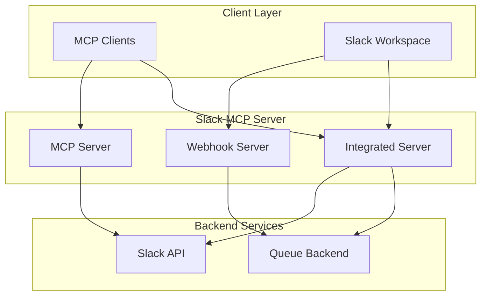

# Slack MCP Server Architecture

This section provides comprehensive documentation of the Slack MCP Server architecture, covering all major components and their interactions.

## Architecture Components

The Slack MCP Server is built with a modular architecture that supports multiple deployment modes and integration patterns:

### **🏗️ [Project Structure](./project-structure)**
- Overall source code organization
- Design patterns and principles
- Directory structure and key components
- Development workflow and conventions

### **🔧 [MCP Server Architecture](./mcp-server-architecture)**
- Model Context Protocol implementation
- Transport mechanisms (stdio, SSE, HTTP)
- Tool registration and execution
- Client communication patterns

### **🌐 [Webhook Server Architecture](./webhook-server-architecture)**
- FastAPI-based webhook server
- Slack event processing
- Queue integration and event publishing
- Security and authentication

### **⚡ [Integrated Server Architecture](./integrated-server-architecture)**
- Combined MCP and webhook server deployment
- Unified FastAPI application
- Transport configuration options
- Production deployment patterns

## System Overview

## Key Features

- **Multiple Transport Options**: stdio, Server-Sent Events (SSE), and HTTP streaming
- **Flexible Deployment**: Standalone MCP server, standalone webhook server, or integrated mode
- **Event Processing**: Asynchronous Slack event handling with queue integration
- **Security**: Request signature verification and token management
- **Scalability**: Horizontal scaling support for webhook processing

## Design Principles

1. **Modularity**: Clear separation between MCP and webhook functionality
2. **Extensibility**: Easy to add new MCP tools and event handlers
3. **Security**: Secure token handling and request verification
4. **Performance**: Asynchronous processing and efficient resource usage
5. **Reliability**: Robust error handling and recovery mechanisms

## Next Steps

Explore the detailed architecture documentation for each component to understand the implementation details, configuration options, and best practices for deployment and development.
