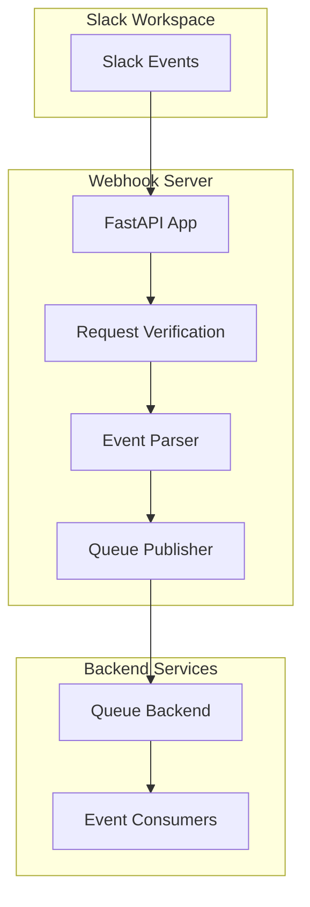
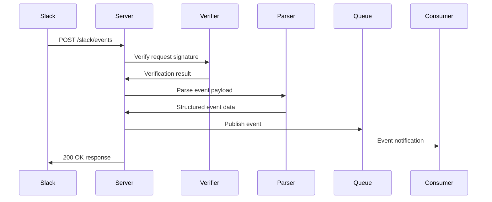

# Webhook Server Architecture

The Webhook Server is a FastAPI-based component that receives and processes Slack events through HTTP webhooks. This document details the architecture, components, and implementation of the webhook server.

## Overview

The Webhook Server provides a secure, scalable endpoint for receiving Slack events. It handles request verification, event parsing, and publishing to queue backends for asynchronous processing. The server can operate in standalone mode or as part of an integrated deployment.



## Core Components

### **FastAPI Application (`server.py`)**

The main webhook server implementation using FastAPI:

```python
from fastapi import FastAPI, Request, HTTPException
from slack_mcp.webhook.server import create_slack_app

app = create_slack_app()
```

**Key Features:**
- High-performance async HTTP server
- Automatic request/response validation
- Built-in OpenAPI documentation
- Comprehensive error handling
- Health check endpoints

### **Request Verification**

Security implementation for Slack request verification:

```python
async def verify_slack_request(request: Request, body: bytes) -> bool:
    signature = request.headers.get("x-slack-signature")
    timestamp = request.headers.get("x-slack-request-timestamp")
    
    # Verify signature using HMAC-SHA256
    expected_signature = create_signature(timestamp, body)
    return hmac.compare_digest(signature, expected_signature)
```

**Security Features:**
- HMAC-SHA256 signature verification
- Timestamp validation to prevent replay attacks
- Environment-based secret management
- Request body integrity checking

### **Event Processing Pipeline**



## API Endpoints

### **POST /slack/events**

Primary webhook endpoint for receiving Slack events:

**Request Headers:**
- `x-slack-signature`: HMAC-SHA256 signature
- `x-slack-request-timestamp`: Unix timestamp
- `content-type`: application/json

**Request Body:**
```json
{
  "token": "verification_token",
  "team_id": "T1234567890",
  "api_app_id": "A1234567890",
  "event": {
    "type": "message",
    "channel": "C1234567890",
    "user": "U1234567890",
    "text": "Hello, world!",
    "ts": "1234567890.123456"
  },
  "type": "event_callback",
  "event_id": "Ev1234567890",
  "event_time": 1234567890
}
```

**Response:**
- `200 OK`: Event processed successfully
- `400 Bad Request`: Invalid request format
- `401 Unauthorized`: Invalid signature
- `500 Internal Server Error`: Processing error

### **URL Verification Challenge**

Handles Slack's URL verification challenge:

```python
@app.post("/slack/events")
async def slack_events(request: Request):
    body = await request.body()
    data = json.loads(body)
    
    # Handle URL verification challenge
    if data.get("type") == "url_verification":
        return {"challenge": data["challenge"]}
```

### **Health Check Endpoints**

Server health and status monitoring:

- `GET /health`: Basic health check
- `GET /health/detailed`: Detailed status including queue connectivity

## Event Processing

### **Supported Event Types**

The webhook server processes various Slack event types:

- **Message Events**: `message`, `message.channels`, `message.groups`
- **User Events**: `user_change`, `team_join`
- **Channel Events**: `channel_created`, `channel_deleted`, `channel_rename`
- **Reaction Events**: `reaction_added`, `reaction_removed`
- **App Events**: `app_mention`, `app_home_opened`

### **Event Parsing and Validation**

Pydantic models for event validation:

```python
from pydantic import BaseModel
from typing import Optional, Dict, Any

class SlackEventModel(BaseModel):
    token: str
    team_id: str
    api_app_id: str
    event: Dict[str, Any]
    type: str
    event_id: str
    event_time: int
    
class UrlVerificationModel(BaseModel):
    token: str
    challenge: str
    type: str
```

### **Queue Integration**

Event publishing to backend queues:

```python
from slack_mcp.backends.queue import get_backend

async def publish_event(event_data: dict):
    backend = get_backend()
    topic = os.getenv("SLACK_EVENTS_TOPIC", "slack.events")
    await backend.publish(topic, event_data)
```

## Configuration

### **Environment Variables**

- `SLACK_SIGNING_SECRET`: Slack app signing secret for verification
- `SLACK_EVENTS_TOPIC`: Queue topic for published events
- `QUEUE_BACKEND_TYPE`: Queue backend selection (redis, memory, etc.)
- `HOST`: Server bind address (default: 0.0.0.0)
- `PORT`: Server port (default: 3000)
- `LOG_LEVEL`: Logging verbosity

### **CLI Configuration**

```bash
slack-webhook-server \
  --host 0.0.0.0 \
  --port 3000 \
  --log-level INFO \
  --retry 3
```

## Deployment Patterns

### **Standalone Mode**

Independent webhook server deployment:

```python
from slack_mcp.webhook.entry import run_webhook_server

# Run standalone webhook server
run_webhook_server(
    host="0.0.0.0",
    port=3000,
    retry=3
)
```

**Use Cases:**
- Microservices architecture
- Dedicated event processing services
- Horizontal scaling of webhook handling
- Integration with external event consumers

### **Docker Deployment**

Containerized webhook server:

```dockerfile
FROM python:3.11-slim
COPY . /app
WORKDIR /app
RUN pip install -e .
EXPOSE 3000
CMD ["slack-webhook-server", "--host", "0.0.0.0", "--port", "3000"]
```

### **Cloud Deployment**

Deployment to cloud platforms:

- **Heroku**: Direct deployment with environment variables
- **AWS Lambda**: Serverless webhook processing
- **Google Cloud Run**: Containerized serverless deployment
- **Kubernetes**: Scalable container orchestration

## Security Considerations

### **Request Security**

- **Signature Verification**: All requests verified using HMAC-SHA256
- **Timestamp Validation**: Prevents replay attacks
- **Secret Management**: Environment-based secret storage
- **HTTPS Enforcement**: TLS encryption for production

### **Input Validation**

- **Pydantic Models**: Automatic request validation
- **Type Checking**: Strict type enforcement
- **Sanitization**: Input sanitization and escaping
- **Rate Limiting**: Optional rate limiting implementation

### **Error Handling**

```python
@app.exception_handler(ValueError)
async def validation_exception_handler(request: Request, exc: ValueError):
    return JSONResponse(
        status_code=400,
        content={"error": "Invalid request format", "detail": str(exc)}
    )
```

## Performance Optimization

### **Async Processing**

- Full async/await implementation
- Non-blocking request handling
- Efficient resource utilization
- Concurrent request processing

### **Connection Management**

- HTTP connection pooling
- Persistent queue connections
- Resource cleanup and lifecycle management
- Memory-efficient event processing

### **Monitoring and Metrics**

- Request/response timing
- Event processing throughput
- Error rate tracking
- Queue health monitoring

## Error Handling and Recovery

### **Error Categories**

- **Verification Errors**: Invalid signatures or timestamps
- **Parsing Errors**: Malformed event payloads
- **Queue Errors**: Backend publishing failures
- **Network Errors**: Connection issues

### **Retry Logic**

```python
async def publish_with_retry(event_data: dict, max_retries: int = 3):
    for attempt in range(max_retries):
        try:
            await backend.publish(topic, event_data)
            return
        except Exception as e:
            if attempt == max_retries - 1:
                logger.error(f"Failed to publish after {max_retries} attempts")
                raise
            await asyncio.sleep(2 ** attempt)  # Exponential backoff
```

## Testing Strategy

### **Unit Testing**

- Request verification testing
- Event parsing validation
- Queue integration mocking
- Error handling scenarios

### **Integration Testing**

- End-to-end webhook flow
- Queue backend integration
- Slack event simulation
- Security verification testing

This webhook server architecture provides a robust, secure, and scalable foundation for processing Slack events while maintaining flexibility for various deployment scenarios and integration patterns.
