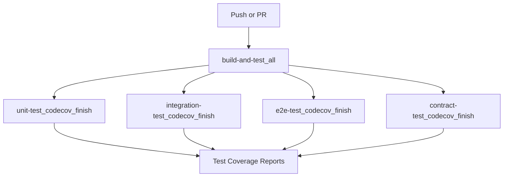

# Continuous Integration

This document covers the Continuous Integration (CI) workflows used to maintain code quality and ensure tests pass in the Slack MCP Server project.

## Status Badges

## Workflow Triggers

Our CI workflow ([`ci.yaml`](https://github.com/Chisanan232/slack-mcp-server/blob/master/.github/workflows/ci.yaml)) is triggered on:

- **Push to master branch**: Excluding branches with "e2e" in their name
- **Pull requests to master**: Excluding branches with "e2e" in their name
- Only when specific paths are modified:
  - GitHub Actions workflow files
  - Python source code (`slack_mcp/**/*.py`)
  - Test files (`test/**/*.py`)
  - Test configuration files ([`.coveragerc`](https://github.com/Chisanan232/slack-mcp-server/blob/master/.coveragerc), [`pytest.ini`](https://github.com/Chisanan232/slack-mcp-server/blob/master/pytest.ini), etc.)
  - Project configuration ([`pyproject.toml`](https://github.com/Chisanan232/slack-mcp-server/blob/master/pyproject.toml), [`uv.lock`](https://github.com/Chisanan232/slack-mcp-server/blob/master/uv.lock))

## CI Workflow Structure

## Main CI Workflow Steps

The CI process uses several reusable workflows to streamline the execution:

### 1. Build and Test ([`rw_build_and_test.yaml`](https://github.com/Chisanan232/slack-mcp-server/blob/master/.github/workflows/rw_build_and_test.yaml))

- Sets up Python environment (Python 3.13)
- Installs dependencies via Poetry
- Runs unit tests, integration tests, and optionally E2E tests
- Generates test coverage reports

### 2. Test Coverage Reporting

For each test type (unit, integration, E2E, contract), the workflow:
- Organizes and processes test coverage data
- Uploads reports to Codecov with specific flags
- Labels reports with the package name (`slack_mcp`)

### 3. Code Quality Checks

As part of the test process, the following checks are performed:
- **MyPy**: Type checking
- **PyLint**: Code analysis based on Google's Python style guide
- **Flake8**: PEP 8 compliance checking
- **Black**: Code formatting verification
- **isort**: Import sorting verification

## Multi-Python Version Testing

The project uses a dedicated workflow ([`rw_uv_run_test_with_multi_py_versions.yaml`](https://github.com/Chisanan232/slack-mcp-server/blob/master/.github/workflows/rw_uv_run_test_with_multi_py_versions.yaml)) to test across multiple Python versions, ensuring compatibility.

---

## Navigation

- **🏠 [CI/CD Overview](./index)** - Return to main CI/CD hub
- **🔄 [Release System](./release-system)** - Learn about releases and deployment
- **⚙️ [Additional CI Workflows](./additional-ci-workflows)** - Specialized utility workflows
- **🛠️ [Developer Guide](./developer-guide)** - Configuration and troubleshooting
