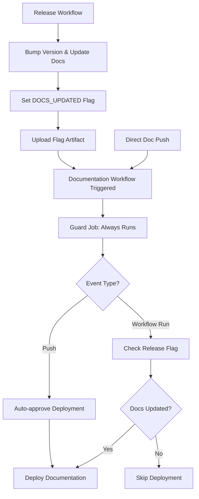
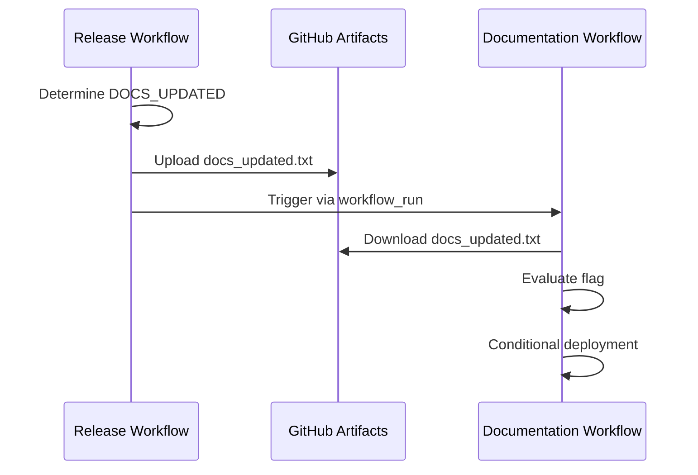

import TOCInline from '@theme/TOCInline';

# Documentation Deployment


[](https://github.com/Chisanan232/slack-mcp-server/actions/workflows/documentation.yaml)

The documentation workflow (`documentation.yaml`) handles building and deploying project documentation using **dual trigger mechanisms** to ensure reliable deployment after releases. This system solves critical GitHub Actions limitations for automated documentation updates during releases.

<TOCInline toc={toc} />

## Overview

The documentation deployment system features:

- **Dual Trigger Architecture**: Handles both direct documentation changes and release-triggered updates
- **Workflow Run Pattern**: Solves GitHub Actions `GITHUB_TOKEN` commit limitation
- **Intelligent Guard Jobs**: Conditional deployment based on actual documentation changes
- **Artifact-Based Communication**: Reliable cross-workflow communication via artifacts
- **GitHub Pages Integration**: Automated deployment to GitHub Pages with Docusaurus

## Advanced Trigger Architecture

The documentation workflow uses a **sophisticated dual-trigger system** to solve the GitHub Actions limitation where `GITHUB_TOKEN` commits don't trigger other workflows:

### 1. Direct Push Trigger (Traditional)
```yaml
on:
  push:
    branches: ["master"]
    paths: 
      - "docs/**"
      - "*.md"
      - "README*.md"
      - ".github/workflows/documentation.yaml"
      - ".github/workflows/release.yml"
      - ".github/workflows/release-*.yml"
      - ".github/workflows/rw_*.yaml"
      - ".github/tag_and_release/**"
```

**Purpose**: Handles direct documentation changes pushed to master branch

**Triggers On**:
- Documentation file changes
- Workflow file changes that affect release processes
- Configuration changes that impact documentation

### 2. Workflow Run Trigger (Release Integration)
```yaml
on:
  workflow_run:
    workflows: ["release"]
    types: [completed]
    branches: ["master"]
```

**Purpose**: Automatically triggers after release workflow completion to handle documentation updates made during version bumps

## Workflow Run Pattern Implementation

### Problem Solved

**GitHub Actions Limitation**: GitHub Actions doesn't trigger workflows on commits made by `GITHUB_TOKEN` (used in release workflows) to prevent infinite loops. This caused documentation workflow to never trigger after release workflow commits that updated documentation files.

**Critical Bug Fixed**: The original implementation had a dependency issue where the `check_docs_changes` job only ran for `workflow_run` events, but the deployment job depended on it for all events. This caused push events to never deploy because GitHub Actions skips dependent jobs when their dependencies are skipped.

**Impact**: 
- Documentation would become stale after releases because version references in docs weren't being deployed
- **Direct documentation pushes were completely broken** - they would never trigger deployment due to the skipped dependency

### Solution Architecture



### Guard Job Implementation

The documentation workflow includes an intelligent **guard job** that provides conditional deployment logic:

#### Guard Job Logic

```yaml
check_docs_changes:
  runs-on: ubuntu-latest
  outputs:
    should_deploy: ${{ steps.check_changes.outputs.should_deploy || steps.set_push_deploy.outputs.should_deploy }}
  steps:
    - name: Set deployment flag for push events
      id: set_push_deploy
      if: github.event_name == 'push'
      run: |
        echo "Direct push event detected, proceeding with deployment"
        echo "should_deploy=true" >> $GITHUB_OUTPUT

    - name: Download docs update flag from release workflow
      if: github.event_name == 'workflow_run'
      uses: actions/download-artifact@v5
      with:
        name: release-docs-flag
        github-token: ${{ secrets.GITHUB_TOKEN }}
        run-id: ${{ github.event.workflow_run.id }}
    
    - name: Check release workflow success and docs update flag
      id: check_changes
      if: github.event_name == 'workflow_run'
      run: |
        set -euo pipefail
        
        # Verify release workflow succeeded
        if [[ "${{ github.event.workflow_run.conclusion }}" != "success" ]]; then
          echo "Release workflow failed, skipping documentation deployment"
          echo "should_deploy=false" >> $GITHUB_OUTPUT
          exit 0
        fi
        
        # Read docs update flag from artifact  
        DOCS_UPDATED=$(cat docs_updated.txt)
        echo "Documentation updated flag: $DOCS_UPDATED"
        
        if [[ "$DOCS_UPDATED" == "true" ]]; then
          echo "Documentation was updated during release, proceeding with deployment"
          echo "should_deploy=true" >> $GITHUB_OUTPUT
        else
          echo "No documentation files were updated, skipping deployment"
          echo "should_deploy=false" >> $GITHUB_OUTPUT
        fi
```

#### Guard Job Functions

**For Push Events**:
1. **Immediate Approval**: Sets `should_deploy=true` since documentation files were changed (triggering the workflow)
2. **No Artifact Processing**: Skips artifact-related steps as they're not needed for direct pushes

**For Workflow Run Events**:
1. **Downloads Release Artifacts**: Retrieves the `DOCS_UPDATED` flag from the completed release workflow
2. **Verifies Release Success**: Ensures the release workflow completed successfully
3. **Evaluates Update Flag**: Checks if documentation files were actually updated during the release
4. **Controls Deployment**: Only proceeds with documentation deployment if docs were updated

### Conditional Deployment Logic

The main deployment job runs conditionally based on the trigger type:

```yaml
deploy_documentation:
  runs-on: ubuntu-latest
  # Run based on the check_docs_changes job output (which handles both push and workflow_run events)
  if: needs.check_docs_changes.outputs.should_deploy == 'true'
  needs: [check_docs_changes]
```

**Deployment Conditions**:
- **Direct Push Events**: Always deploy because the guard job automatically approves (`should_deploy=true`)
- **Workflow Run Events**: Only deploy if guard job approves after checking the release flag (`should_deploy=true`)

## Release Workflow Integration

The **release workflow** (`release.yml`) has been enhanced to support this pattern through the `DOCS_UPDATED` flag system.

### DOCS_UPDATED Flag Generation

During the version bump process, the release workflow:

#### 1. Tracks Documentation Updates
Uses existing `DOCS_UPDATED` flag from bump step logic that already determines if documentation files need updating:

```bash
# Version bump logic already sets DOCS_UPDATED flag
DOCS_UPDATED=false

# Check if documentation files that reference versions need updating
if [[ -f "docs/contents/development/ci-cd/index.mdx" ]] || 
   [[ -f "docs/contents/document/installation.md" ]] || 
   [[ -f "docs/contents/document/README.md" ]]; then
    DOCS_UPDATED=true
fi
```

#### 2. Updates Version References
Automatically updates documentation files that reference the package version:
- `docs/contents/development/ci-cd/index.mdx`
- `docs/contents/document/installation.md`  
- `docs/contents/document/README.md`

#### 3. Sets Output Flag
Outputs the `DOCS_UPDATED` flag for downstream workflows:

```bash
# Output DOCS_UPDATED flag for documentation workflow trigger
echo "docs_updated=$DOCS_UPDATED" >> $GITHUB_OUTPUT
```

#### 4. Emits Artifact
Uploads the flag as an artifact for the documentation workflow:

```yaml
- name: Upload docs update flag for downstream documentation workflow
  uses: actions/upload-artifact@v4
  with:
    name: release-docs-flag
    path: docs_updated.txt
    retention-days: 1
```

## Documentation Deployment Process

### Environment Setup

The documentation deployment uses modern Node.js tooling:

```yaml
- name: Setup Node.js
  uses: actions/setup-node@v4
  with:
    node-version: '22'

- name: Setup pnpm
  uses: pnpm/action-setup@v4
  with:
    version: 8
    run_install: false

- name: Get pnpm store directory
  shell: bash
  run: echo "STORE_PATH=$(pnpm store path --silent)" >> $GITHUB_ENV

- name: Setup pnpm cache
  uses: actions/cache@v4
  with:
    path: ${{ env.STORE_PATH }}
    key: ${{ runner.os }}-pnpm-store-${{ hashFiles('**/pnpm-lock.yaml') }}
    restore-keys: |
      ${{ runner.os }}-pnpm-store-
```

### Build Process

**Docusaurus Build Steps**:

1. **Install Dependencies**:
   ```bash
   pnpm install --frozen-lockfile
   ```

2. **Build Static Documentation**:
   ```bash
   pnpm build
   ```

3. **Generate Optimized Assets**:
   - Static HTML, CSS, and JavaScript
   - Optimized images and assets
   - Search index generation
   - PWA manifests

### GitHub Pages Deployment

**Deployment Steps**:

1. **Configure GitHub Pages Environment**:
   ```yaml
   - name: Setup Pages
     uses: actions/configure-pages@v5
   ```

2. **Upload Built Documentation**:
   ```yaml
   - name: Upload artifact
     uses: actions/upload-pages-artifact@v3
     with:
       path: ./build
   ```

3. **Deploy to GitHub Pages**:
   ```yaml
   - name: Deploy to GitHub Pages
     id: deployment
     uses: actions/deploy-pages@v4
   ```

## Key Benefits

✅ **Reliable Triggering**: Documentation deploys automatically after releases that update docs  
✅ **No Infinite Loops**: Guard job prevents unnecessary deployments  
✅ **Efficient**: Only deploys when documentation actually changes  
✅ **Backward Compatible**: Direct push functionality remains unchanged  
✅ **Intelligent**: Uses existing business logic to determine if docs need updating  
✅ **Fast**: Leverages pnpm caching for quick builds  
✅ **Robust**: Multiple fallback mechanisms and error handling  
✅ ****BUG FIXED**: Push events now correctly trigger documentation deployment**

## Advanced Features

### Multi-Path Trigger Monitoring

The workflow monitors multiple file paths to ensure comprehensive documentation updates:

```yaml
paths:
  - "docs/**"                           # Core documentation
  - "*.md"                             # Root markdown files
  - "README*.md"                       # README variants
  - ".github/workflows/documentation.yaml"  # This workflow
  - ".github/workflows/release.yml"    # Release workflow
  - ".github/workflows/release-*.yml"  # Release variants
  - ".github/workflows/rw_*.yaml"      # Reusable workflows
  - ".github/tag_and_release/**"       # Release configuration
```

### Intelligent Artifact Management

**Artifact Lifecycle**:
- **Creation**: Release workflow creates `release-docs-flag` artifact
- **Consumption**: Documentation workflow downloads and reads flag
- **Cleanup**: Artifacts automatically expire after 1 day
- **Error Handling**: Missing artifacts result in graceful skipping

### Cross-Workflow Communication

**Communication Pattern**:


## Troubleshooting

### Common Issues and Solutions

#### Documentation Not Deploying After Push Events

**Symptoms**: Documentation doesn't deploy after direct pushes to master branch with documentation changes.

**Status**: **🔧 FIXED** - This was a critical bug in the original implementation where push events would never deploy due to skipped job dependencies.

**Previous Issue**: The guard job was set to only run for `workflow_run` events, but the deployment job always depended on it, causing push events to be skipped.

**Current Solution**: The guard job now runs for all events and handles both push and workflow_run logic internally.

#### Documentation Not Deploying After Release

**Symptoms**: Documentation doesn't update after a release that should have triggered it.

**Diagnosis Steps**:
1. Check that the release workflow completed successfully
2. Verify that documentation files were actually updated (check `DOCS_UPDATED` flag in release logs)
3. Review the guard job output in the documentation workflow
4. Ensure the `release-docs-flag` artifact was created

**Solutions**:
```bash
# Check release workflow status
gh run list --workflow=release.yml --limit=1

# Check documentation workflow status  
gh run list --workflow=documentation.yaml --limit=1

# View specific run logs
gh run view <run-id> --log
```

#### Guard Job Failing

**Symptoms**: Documentation workflow guard job fails with artifact download errors.

**Common Causes**:
- Release workflow didn't upload the `release-docs-flag` artifact
- Artifact download permissions incorrect
- Workflow run ID not accessible

**Solutions**:
1. **Check Artifact Upload**:
   ```yaml
   # Verify this step exists in release workflow
   - name: Upload docs update flag for downstream documentation workflow
     uses: actions/upload-artifact@v4
     with:
       name: release-docs-flag
       path: docs_updated.txt
   ```

2. **Verify Permissions**:
   ```yaml
   permissions:
     contents: read
     actions: read  # Required for artifact download
   ```

3. **Check Workflow Run ID**:
   ```bash
   # The workflow_run event should provide the correct run ID
   echo "Release run ID: ${{ github.event.workflow_run.id }}"
   ```

#### Deployment Timing Issues

**Expected Behavior**:
- Workflow run triggers happen after the triggering workflow completes
- Documentation deployment occurs ~1-2 minutes after release completion
- Monitor both workflows to track the complete process

**Debugging Timeline**:
1. Release workflow starts and completes
2. Documentation workflow triggered via `workflow_run`
3. Guard job evaluates `DOCS_UPDATED` flag
4. Deployment job runs if flag is `true`

### Performance Optimization

#### Build Speed Improvements

**pnpm Caching Strategy**:
```yaml
- name: Setup pnpm cache
  uses: actions/cache@v4
  with:
    path: ${{ env.STORE_PATH }}
    key: ${{ runner.os }}-pnpm-store-${{ hashFiles('**/pnpm-lock.yaml') }}
    restore-keys: |
      ${{ runner.os }}-pnpm-store-
```

**Benefits**:
- ~60% faster builds on cache hit
- Reduced bandwidth usage
- More reliable builds in case of registry issues

#### Conditional Processing

**Skip Logic**:
- Guard job prevents unnecessary builds
- Direct evaluation of `DOCS_UPDATED` flag
- Early exit for workflow_run events with no doc changes

## Best Practices

### For Contributors

1. **Documentation Changes**: Direct documentation changes trigger immediate deployment
2. **Release Integration**: Version-related doc updates happen automatically during releases
3. **Testing**: Use staging branches to test documentation changes before merging
4. **Monitoring**: Check both release and documentation workflow statuses for complete picture

### For Maintainers

1. **Artifact Management**: Keep artifact retention short (1 day) to save storage
2. **Error Handling**: Monitor guard job failures and artifact issues
3. **Performance**: Review build times and optimize pnpm cache usage
4. **Security**: Ensure proper permissions for cross-workflow artifact access

### Configuration Management

**Release Integration Checklist**:
- ✅ Release workflow outputs `DOCS_UPDATED` flag
- ✅ Release workflow uploads `release-docs-flag` artifact  
- ✅ Documentation workflow has `workflow_run` trigger
- ✅ Guard job correctly evaluates flag
- ✅ Deployment job has proper conditional logic

---

🔗 **Related Documentation**:
- [Release System](./release-system.mdx) - Learn about the release workflow that triggers documentation updates
- [Continuous Integration](./continuous-integration.mdx) - Understanding the broader CI/CD context
- [Developer Guide](./developer-guide.mdx) - Advanced troubleshooting and configuration
