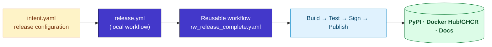
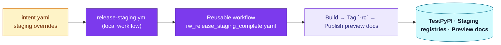
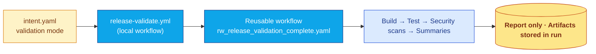

# Release System

The release workflows for this template are now maintained in the centralized repository `Chisanan232/GitHub-Action_Reusable_Workflows-Python`. This project consumes those reusable workflows for production, validation, and staging releases while keeping only minimal configuration locally.

## Release workflows

### Production release (`release.yml`)

Publishes production artifacts (PyPI package, container images, docs) using the centralized `rw_release_complete.yaml` workflow logic.

- **Purpose** – Ship the production-ready version of your project whenever you approve a release.
- **Effects** – Builds from locked dependencies, signs artifacts (if configured), pushes semantic tags, and updates changelog summaries.
- **Targets** – PyPI (wheel + sdist), Docker Hub/GHCR images, and the published Docusaurus docs site.

- **Documentation** – See the reusable workflow guide for production releases: [rw_release_complete.yaml](https://chisanan232.github.io/GitHub-Action_Reusable_Workflows-Python/docs/next/workflows/release/rw_release_complete) (hosted in `Chisanan232/GitHub-Action_Reusable_Workflows-Python`).

:::note Documentation
See the reusable workflow guide for production releases: [rw_release_complete.yaml](https://chisanan232.github.io/GitHub-Action_Reusable_Workflows-Python/docs/next/workflows/release/rw_release_complete) (hosted in `Chisanan232/GitHub-Action_Reusable_Workflows-Python`).
:::

### Release staging (`release-staging.yml`)

Creates staging/TestPyPI packages, RC container images, and preview documentation to test releases before production.

- **Purpose** – Provide a safe rehearsal of the full release pipeline with artifacts you can share internally.
- **Effects** – Publishes release-candidate packages, tags container images with `-rc`, and deploys docs to preview channels without touching production identifiers.
- **Targets** – TestPyPI, staging container registries (Docker Hub/GHCR), and preview docs buckets or branches.

- **Documentation** – Reusable staging workflow reference: [rw_release_staging_complete.yaml](https://chisanan232.github.io/GitHub-Action_Reusable_Workflows-Python/docs/next/workflows/release/rw_release_staging_complete).

:::note Documentation
Reusable staging workflow reference: [rw_release_staging_complete.yaml](https://chisanan232.github.io/GitHub-Action_Reusable_Workflows-Python/docs/next/workflows/release/rw_release_staging_complete).
:::

### Release validation (`release-validate.yml`)

Dry-runs the release pipeline for pull requests, verifying builds and security checks without publishing artifacts.

- **Purpose** – Catch packaging, signing, or configuration issues before they reach staging or production.
- **Effects** – Executes the same jobs as a real release (build, test, SBOM, signing) but discards artifacts after validation.
- **Targets** – No registries are updated; results remain within the PR context and GitHub Actions artifact storage for review.

- **Documentation** – Reusable validation workflow details: [rw_release_validation_complete.yaml](https://chisanan232.github.io/GitHub-Action_Reusable_Workflows-Python/docs/next/workflows/release/rw_release_validation_complete).

:::note Documentation
Reusable validation workflow details: [rw_release_validation_complete.yaml](https://chisanan232.github.io/GitHub-Action_Reusable_Workflows-Python/docs/next/workflows/release/rw_release_validation_complete).
:::

## Overview

- **Centralized logic**: All release orchestration lives in the [reusable workflow repository](https://github.com/Chisanan232/GitHub-Action_Reusable_Workflows-Python).
- **Multi-target support**: Python packages, container images, and documentation publishing remain available through the shared workflows.
- **Configuration-driven**: Child projects configure releases via `intent.yaml`, delegating implementation details to the centralized workflows.
- **Release targets at a glance**:
  - PyPI for production Python packages
  - TestPyPI for staging/validation builds
  - Docker Hub and GitHub Container Registry for container images
  - Docusaurus documentation deployments

:::note Learn more
For complete release architecture diagrams, configuration options, and usage guides, see the official documentation:

- **Repository**: [Chisanan232/GitHub-Action_Reusable_Workflows-Python](https://github.com/Chisanan232/GitHub-Action_Reusable_Workflows-Python)
- **Documentation**: [Release System & Workflows Guide](https://chisanan232.github.io/GitHub-Action_Reusable_Workflows-Python/docs/next/introduction)

These resources provide the authoritative, up-to-date reference for release operations after the migration to centralized workflows.
:::

## Working in this template

- Maintain `intent.yaml` to control release behavior for this project.
- Ensure workflow references point to the centralized repository (for example, `uses: Chisanan232/GitHub-Action_Reusable_Workflows-Python/.github/workflows/rw_release_complete.yaml@main`).
- Use the linked documentation for detailed steps, troubleshooting, and advanced configuration.
