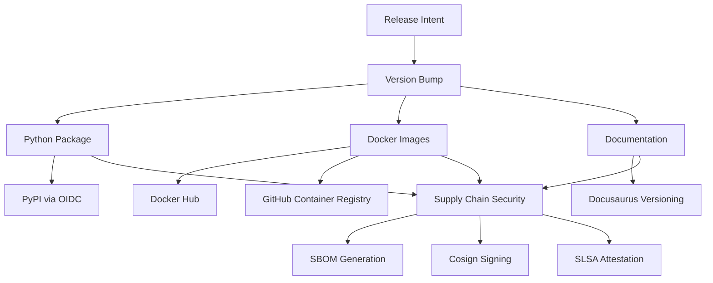
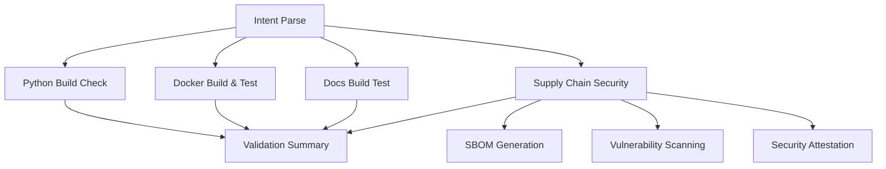
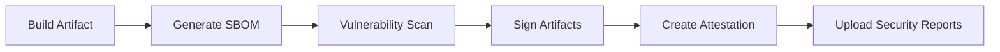

import TOCInline from '@theme/TOCInline';

# Release System


The slack-mcp-server uses a comprehensive, intent-driven release system that supports multi-target deployments with full supply chain security. The system provides production, validation, and staging workflows for safe and reliable releases.

<TOCInline toc={toc} />

## Overview

The release system follows modern DevOps practices with:

- **Intent-Driven Configuration**: YAML-based release configuration with schema validation
- **Multi-Target Deployment**: Python packages (PyPI), Docker images (dual registry), and documentation (Docusaurus)
- **Supply Chain Security**: SBOM generation, vulnerability scanning, cosign signing, and SLSA attestation
- **Comprehensive Validation**: Pre-release validation without publishing artifacts
- **Staging Environment**: Safe testing environment with TestPyPI and staging tags
- **Git Synchronization**: Fixed critical version sync issues ensuring artifacts use correct bumped versions

## Release Workflows

### 1. Production Release Workflow (`release.yml`)

[](https://github.com/Chisanan232/slack-mcp-server/actions/workflows/release.yml)

**Purpose**: Production releases to PyPI, Docker registries, and documentation deployment

**Triggers:**
- Push to `master` branch
- Manual dispatch (`workflow_dispatch`)

**Multi-Target Deployment Architecture:**



#### Multi-Target Deployments

1. **Python Package** (`PyPI`):
   - Uses `uv build` and `uv publish`
   - OIDC Trusted Publishers for secure authentication
   - **Fixed**: Automatic version synchronization with git sync fix
   - **Enhanced**: `uv.lock` file automatically updated and committed with version bumps
   - Builds from correct bumped version (e.g., 0.0.1, not 0.0.0)

2. **Docker Image** (`GHCR` & `DockerHub`):
   - **Dual Registry Publishing**: Publishes to both registries simultaneously
     - **GitHub Container Registry (GHCR)**: `ghcr.io/chisanan232/slack-mcp-server`
     - **Docker Hub**: `chisanan232/slack-mcp-server`
   - **Parallel Publishing Jobs**: Separate jobs ensure isolated registry operations
   - **Multi-architecture builds**: amd64, arm64 support for both registries
   - **Supply Chain Security**: SBOM generation, Cosign signing, SLSA attestation
   - **Registry-Specific Authentication**: GHCR uses GitHub token, Docker Hub uses dedicated credentials
   - **Consistent Tagging**: Same version tags applied to both registries
   - **Fixed**: Uses correct version tags from git sync fix

3. **Documentation** (`Docusaurus`):
   - **Intelligent Documentation Triggering**: Uses `DOCS_UPDATED` flag to automatically trigger documentation deployment
   - **Version Reference Updates**: Automatically updates documentation files that reference the package version
   - **Workflow Run Pattern**: Triggers documentation workflow via `workflow_run` to overcome `GITHUB_TOKEN` limitations
   - **Multi-section versioning support**: Independent versioning for `docs`, `dev`, and `api` sections
   - **Change detection**: Selective updates based on actual file changes
   - **Matrix-based concurrent processing**: Efficient parallel versioning
   - **Fixed**: Versions using correct bumped version from git sync fix
   
   📖 **For detailed documentation deployment architecture, see [Documentation Deployment](./documentation-deployment.mdx)**

### 2. Release Validation Workflow (`release-validate.yml`)

[](https://github.com/Chisanan232/slack-mcp-server/actions/workflows/release-validate.yml)

**Purpose**: Pre-release validation without publishing artifacts

**Triggers:**
- Pull requests to `master`
- Manual dispatch

**Validation Steps:**



#### Enhanced Security Validation

- **Defensive Checks**: Pre-flight image existence validation
- **Vulnerability Scanning**: Grype integration for CVE detection
- **Fallback SBOM**: Workspace scanning if Docker image scan fails
- **Supply Chain Security**: Full SBOM, signing, and attestation testing

### 3. Staging Release Workflow (`release-staging.yml`)

[](https://github.com/Chisanan232/slack-mcp-server/actions/workflows/release-staging.yml)

**Purpose**: Deploy to staging environments for testing

**Triggers:**
- Manual dispatch only (`workflow_dispatch`)

**Staging Targets:**

1. **TestPyPI**: Pre-release Python packages
2. **GHCR Staging**: Docker images with `-rc` tags
3. **Documentation Preview**: Staging documentation branch

#### Staging Validation Process

- **RC Version Generation**: Creates release candidate versions
- **Staging Artifact Testing**: Validates staging deployments
- **Preview Environment**: Safe testing environment

### Multi-Section Documentation Versioning

The release system supports advanced documentation versioning:

#### Features

- **Section-Based Versioning**: Independent versioning for `docs`, `dev`, and `api` sections
- **Change Detection**: Automatic detection of changes per section
- **Strategy Control**: Version all sections or only changed sections
- **Matrix Processing**: Concurrent versioning for performance

#### Configuration Examples

```yaml
# Legacy format (backward compatible)
docs: "auto"

# Enhanced format
docs:
  mode: "auto"
  sections: ["docs", "dev"]
  strategy: "changed"  # Only version changed sections
```

### Supply Chain Security

All release workflows include comprehensive supply chain security:

#### Security Features

- **SBOM Generation**: Software Bill of Materials with Syft
- **Vulnerability Scanning**: CVE detection with Grype
- **Digital Signing**: Cosign keyless signing
- **Attestation**: SLSA provenance attestation
- **Defensive Programming**: Pre-flight checks and clear error messages

#### Security Workflow



### Release System Benefits

✅ **Configurable**: Intent-based release configuration  
✅ **Secure**: Full supply chain security pipeline  
✅ **Validated**: Comprehensive pre-release validation  
✅ **Staged**: Safe staging environment testing  
✅ **Multi-Target**: Python, Docker, and docs deployment  
✅ **Efficient**: Matrix-based concurrent processing  
✅ **Robust**: Fallback mechanisms and defensive checks

## Release Intent Configuration Reference

The `.github/tag_and_release/intent.yaml` file is the central configuration for controlling release behavior. This section provides comprehensive documentation for all available configuration options.

### Configuration Schema

```yaml
# Master release control
release: true                    # boolean - Enable/disable releases entirely

# Version bump configuration  
level: "auto"                    # string - Version bump level

# Artifact publishing configuration
artifacts:
  python: "auto"                 # string - Python package publishing
  docker: "auto"                 # string - Docker image publishing
  docs:                          # object | string - Documentation versioning
    mode: "auto"                 # string - Docs versioning mode
    sections: ["docs", "dev"]    # array - Docusaurus sections to version
    strategy: "changed"          # string - Versioning strategy

# Release notes
notes: "Release description"     # string - GitHub release notes
```

### Configuration Options

#### 1. Master Release Control

**`release`** (boolean, default: `true`)
- `true`: Enable release processing
- `false`: Skip all release operations

```yaml
# Enable releases
release: true

# Disable releases entirely
release: false
```

#### 2. Version Bump Level

**`level`** (string, default: `"auto"`)
Controls semantic version bumping:

- `"auto"`: Determine version bump automatically based on commit messages
- `"patch"`: Force patch version bump (e.g., 1.0.0 → 1.0.1)
- `"minor"`: Force minor version bump (e.g., 1.0.0 → 1.1.0)
- `"major"`: Force major version bump (e.g., 1.0.0 → 2.0.0)

```yaml
# Automatic version detection
level: auto

# Force specific version bumps
level: patch  # 1.0.0 → 1.0.1
level: minor  # 1.0.0 → 1.1.0 
level: major  # 1.0.0 → 2.0.0
```

#### 3. Python Package Configuration

**`artifacts.python`** (string, default: `"auto"`)
Controls Python package publishing to PyPI:

- `"auto"`: Publish if package files changed
- `"force"`: Always publish regardless of changes
- `"skip"`: Skip Python package publishing

```yaml
artifacts:
  # Conditional publishing (recommended)
  python: auto
  
  # Always publish
  python: force
  
  # Skip publishing
  python: skip
```

#### 4. Docker Image Configuration

**`artifacts.docker`** (string, default: `"auto"`)
Controls Docker image publishing to **both Docker Hub and GitHub Container Registry (GHCR)**:

- `"auto"`: Publish if Docker-related files changed (Dockerfile, scripts, etc.)
- `"force"`: Always publish to both registries regardless of changes
- `"skip"`: Skip Docker image publishing to both registries

```yaml
artifacts:
  # Conditional publishing (recommended)
  docker: auto    # Publishes to both registries if Docker files changed
  
  # Always publish
  docker: force   # Always publishes to both registries
  
  # Skip publishing
  docker: skip    # Skips both registries
```

:::info Dual Registry Publishing Details
When `docker: auto` or `docker: force`, the workflow creates **two parallel jobs**:

1. **Docker Hub Job** (`release_docker_dockerhub`):
   - Registry: `docker.io`
   - Image: `chisanan232/slack-mcp-server:VERSION`
   - Authentication: DockerHub credentials (`DOCKERHUB_USERNAME`, `DOCKERHUB_TOKEN`)

2. **GHCR Job** (`release_docker_ghcr`):
   - Registry: `ghcr.io`  
   - Image: `ghcr.io/chisanan232/slack-mcp-server:VERSION`
   - Authentication: GitHub token (`GITHUB_TOKEN`)

Both jobs run **simultaneously** and produce **identical images** with the same version tags.
:::

#### 5. Documentation Configuration

**`artifacts.docs`** (object | string)
Controls documentation versioning with support for both legacy and enhanced formats.

##### Legacy Format (String)

```yaml
artifacts:
  docs: "auto"  # auto, force, skip
```

##### Enhanced Format (Object)

```yaml
artifacts:
  docs:
    mode: "auto"              # auto, force, skip
    sections: ["docs", "dev"]  # array of section names
    strategy: "changed"       # changed, always
```

**Configuration Options:**

**`docs.mode`** (string, default: `"auto"`)
- `"auto"`: Version docs based on strategy and change detection
- `"force"`: Always version docs regardless of changes or strategy
- `"skip"`: Skip documentation versioning entirely

**`docs.sections`** (array, default: `["docs", "dev"]`)
Array of Docusaurus plugin IDs to version:
- `"docs"`: Main user documentation
- `"dev"`: Development/contributor documentation
- `"api"`: API reference documentation

**`docs.strategy`** (string, default: `"changed"`)
- `"changed"`: Only version sections that have file changes
- `"always"`: Version all configured sections regardless of changes

### Configuration Examples

#### Example 1: Conservative Release (Recommended)
```yaml
# Only release what has actually changed
release: true
level: auto
artifacts:
  python: auto
  docker: auto
  docs:
    mode: auto
    sections: ["docs", "dev"]
    strategy: changed
notes: "Automatic release with change detection"
```

#### Example 2: Force Full Release
```yaml
# Force release all artifacts regardless of changes
release: true
level: patch
artifacts:
  python: force
  docker: force
  docs:
    mode: force
    sections: ["docs", "dev", "api"]
    strategy: always
notes: "Full release of all components"
```

#### Example 3: Selective Release
```yaml
# Only release Python package, skip others
release: true
level: minor
artifacts:
  python: force
  docker: skip
  docs: skip
notes: "Python package only release"
```

#### Example 4: Documentation-Only Release
```yaml
# Only version documentation
release: true
level: patch
artifacts:
  python: skip
  docker: skip
  docs:
    mode: force
    sections: ["docs", "dev"]
    strategy: always
notes: "Documentation update release"
```

### Behavioral Matrix

| Configuration | Changed Files | Behavior |
|---------------|---------------|----------|
| `python: auto` | Python files changed | ✅ Publishes to PyPI |
| `python: auto` | No Python files changed | ⏭️ Skips publishing |
| `python: force` | Any/no changes | ✅ Always publishes |
| `python: skip` | Any/no changes | ⏭️ Always skips |
| `docs.mode: auto, strategy: changed` | Docs files changed | ✅ Versions changed sections |
| `docs.mode: auto, strategy: always` | Any changes | ✅ Versions all sections |
| `docs.mode: force` | Any/no changes | ✅ Always versions |

### Configuration Validation

The release intent parser includes JSON schema validation to ensure configuration correctness:

- **Invalid Options**: Unsupported values are rejected with clear error messages
- **Type Checking**: Ensures correct data types for all fields
- **Required Fields**: Validates that essential configuration is present
- **Default Values**: Applies sensible defaults for missing optional fields

**Example Validation Errors:**

```yaml
# ❌ Invalid configuration
level: invalid_level        # Error: Must be auto, patch, minor, or major
artifacts:
  docs:
    strategy: invalid       # Error: Must be changed or always
    sections: "not-array"   # Error: Must be array of strings
```

## Developer Guide

### Using the Release System

#### 1. Configuring a Release

Edit `.github/tag_and_release/intent.yaml` to configure your release:

```yaml
# Example: Patch release with selective docs versioning
version_bump: "patch"
python: "auto"
docker: "auto"
docs:
  mode: "auto"
  sections: ["docs", "dev"]  # Only version docs and dev sections
  strategy: "changed"        # Only version if changes detected
github_release: "auto"
```

#### 2. Triggering Releases

**Automatic Release** (Push to master):
```bash
git push origin master
# Triggers release workflow automatically
```

**Manual Release** (GitHub UI):
1. Go to Actions → Release
2. Click "Run workflow"
3. Optionally override intent configuration

#### 3. Pre-Release Validation

**For Pull Requests:**
- Release validation runs automatically on PRs to master
- Provides comprehensive validation without publishing
- Reviews security scan results and vulnerability reports

**Manual Validation:**
```bash
# Trigger validation workflow manually
gh workflow run release-validate.yml
```

#### 4. Staging Releases

**Deploy to Staging:**
```bash
# Manual staging release
gh workflow run release-staging.yml
```

**Staging Artifacts:**
- **TestPyPI**: `pip install -i https://test.pypi.org/simple/ slack-mcp-server`
- **GHCR Staging**: `docker pull ghcr.io/chisanan232/slack-mcp-server:1.0.0-rc.0`
- **Preview Docs**: Available on docs-preview branch

### Common Workflows

#### Release Preparation

1. **Update Code**: Make your changes and ensure tests pass
2. **Configure Intent**: Set release configuration in `intent.yaml`
3. **Validate**: Create PR and review validation results
4. **Stage** (Optional): Test in staging environment
5. **Release**: Merge to master for automatic release

#### Troubleshooting

**Git Synchronization Issues:**
- **Fixed**: Critical issue where artifacts built with old version (0.0.0) instead of bumped version (0.0.1)
- **Root Cause**: Downstream jobs used `actions/checkout@v5` without `ref` parameter, defaulting to original commit SHA
- **Solution**: All workflows now use `ref: ${{ github.ref_name }}` to checkout latest branch state
- **Impact**: Python packages, Docker images, and docs now use correct bumped version

**UV Lock File Synchronization:**
- **Enhanced**: Version bump now automatically updates `uv.lock` file to maintain dependency synchronization
- **Process**: After `uv version --bump`, the workflow runs `uv lock` to update lock file
- **Commit**: Both `pyproject.toml` and `uv.lock` are committed together in version bump
- **Benefit**: Ensures dependency lock file stays in sync with version changes

**Tag Mismatch Issues:**
- Check that Docker build and security scan jobs use consistent tags
- Validation workflow includes defensive checks to catch this early

**SBOM Generation Failures:**
- System includes fallback SBOM generation from workspace
- Check security scan artifacts for detailed logs

### Best Practices

1. **Use Conservative Configuration**: Start with `auto` settings and change detection
2. **Validate Before Release**: Always run validation workflows on PRs
3. **Test in Staging**: Use staging environment for major releases
4. **Monitor Security**: Review security scan results and vulnerability reports
5. **Version Documentation**: Keep documentation in sync with code changes

---

🔗 **Next Steps:**
- [Documentation Deployment](./documentation-deployment.mdx) - Learn about the documentation deployment architecture
- [Reusable Workflows](./reusable-workflows.mdx) - Understand the underlying workflow components
- [Developer Guide](./developer-guide.mdx) - Advanced configuration and troubleshooting
