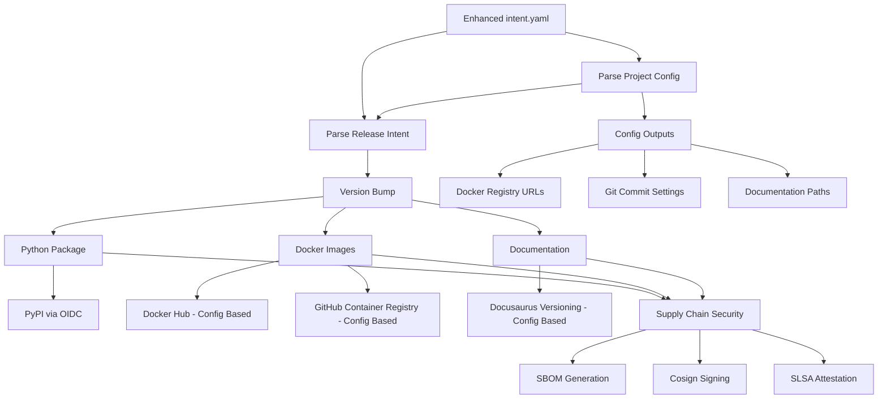
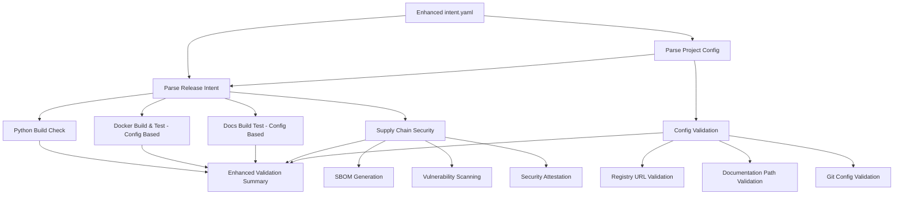
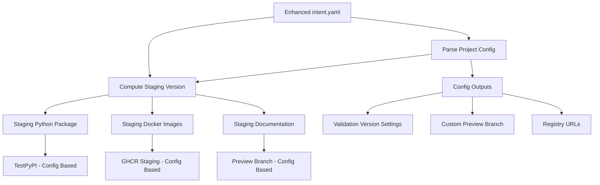
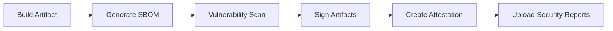
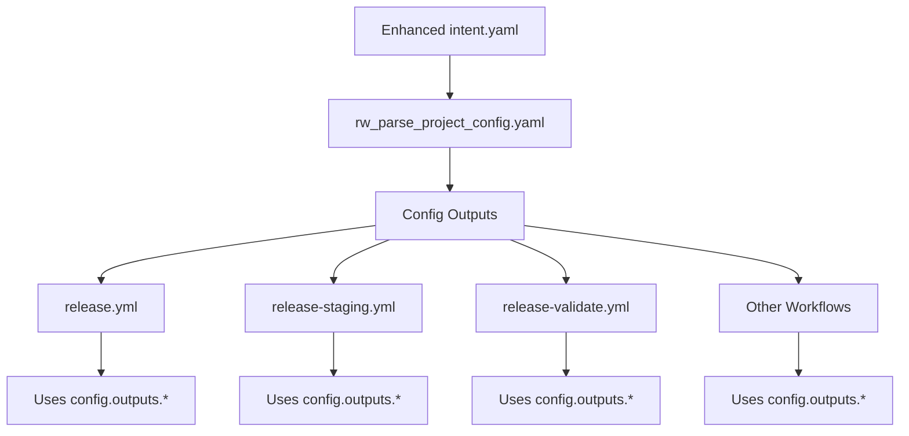
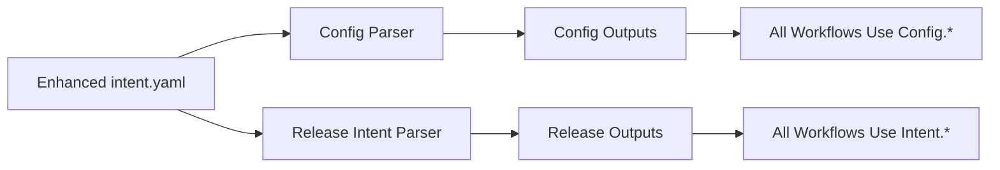

import TOCInline from '@theme/TOCInline';

# Release System


The test-python-uv-project-template uses a comprehensive, intent-driven release system that supports multi-target deployments with full supply chain security. The system provides production, validation, and staging workflows for safe and reliable releases.

<TOCInline toc={toc} />

## Overview

The release system follows modern DevOps practices with:

- **Intent-Driven Configuration**: YAML-based release configuration with schema validation
- **Multi-Target Deployment**: Python packages (PyPI), Docker images (dual registry), and documentation (Docusaurus)
- **Supply Chain Security**: SBOM generation, vulnerability scanning, cosign signing, and SLSA attestation
- **Comprehensive Validation**: Pre-release validation without publishing artifacts
- **Staging Environment**: Safe testing environment with TestPyPI and staging tags
- **Git Synchronization**: Fixed critical version sync issues ensuring artifacts use correct bumped versions

## Release Workflows

### 1. Production Release Workflow (`release.yml`)

[](https://github.com/Chisanan232/Template-Python-UV-Project/actions/workflows/release.yml)

**Purpose**: Production releases to PyPI, Docker registries, and documentation deployment

**Triggers:**
- Push to `master` branch
- Manual dispatch (`workflow_dispatch`)

**Enhanced Config-Based Architecture:**



#### Enhanced Workflow Steps

The production release workflow now includes an **enhanced config-based flow** with the following steps:

**Step 1: Configuration Parsing**
```yaml
config:
  name: Parse Configuration
  uses: Chisanan232/Template-Python-UV-Project/.github/workflows/rw_parse_project_config.yaml@master
```
- Parses enhanced `intent.yaml` with project, docker, git, validation, and docs configuration
- Provides structured outputs for all downstream jobs
- Auto-detects project name and package name from repository and `pyproject.toml`
- Applies smart defaults for missing configuration sections

**Step 2: Release Intent Analysis** 
```yaml
intent:
  uses: Chisanan232/Template-Python-UV-Project/.github/workflows/rw_parse_release_intent.yaml@master
  needs: config
```
- Validates release intent against enhanced JSON schema
- Compatible with both legacy and enhanced configuration formats
- Determines release artifacts (python, docker, docs) based on configuration

#### Multi-Target Deployments

1. **Python Package** (`PyPI`) - **Config Enhanced**:
   - Uses `uv build` and `uv publish`
   - OIDC Trusted Publishers for secure authentication
   - **Config Integration**: Uses `${{ needs.config.outputs.package_name }}` for package identification
   - **Git Configuration**: Commits using `${{ needs.config.outputs.git_commit_name }}` and `${{ needs.config.outputs.git_commit_email }}`
   - **Fixed**: Automatic version synchronization with git sync fix
   - **Enhanced**: `uv.lock` file automatically updated and committed with version bumps
   - Builds from correct bumped version (e.g., 0.0.1, not 0.0.0)

2. **Docker Image** (`GHCR` & `DockerHub`) - **Config Enhanced**:
   - **Config-Based Registry URLs**: 
     - **Docker Hub**: Uses `${{ needs.config.outputs.docker_registry_dockerhub }}`
     - **GHCR**: Uses `${{ needs.config.outputs.docker_registry_ghcr }}`
   - **Health Check Configuration**: Uses config-based `${{ needs.config.outputs.docker_health_check_path }}` and `${{ needs.config.outputs.docker_health_check_port }}`
   - **Application Environment**: Uses `${{ needs.config.outputs.docker_app_env_name }}` and `${{ needs.config.outputs.docker_app_env_value }}`
   - **Dual Registry Publishing**: Publishes to both registries simultaneously
   - **Parallel Publishing Jobs**: Separate jobs ensure isolated registry operations
   - **Multi-architecture builds**: amd64, arm64 support for both registries
   - **Supply Chain Security**: SBOM generation, Cosign signing, SLSA attestation
   - **Registry-Specific Authentication**: GHCR uses GitHub token, Docker Hub uses dedicated credentials
   - **Consistent Tagging**: Same version tags applied to both registries
   - **Fixed**: Uses correct version tags from git sync fix

3. **Documentation** (`Docusaurus`) - **Config Enhanced**:
   - **Config-Based Documentation Paths**: Uses structured config outputs:
     - **README Path**: `${{ needs.config.outputs.docs_readme_path }}`
     - **Installation Guide**: `${{ needs.config.outputs.docs_installation_path }}`
     - **CI/CD Documentation**: `${{ needs.config.outputs.docs_ci_cd_path }}`
   - **Preview Branch Configuration**: Uses `${{ needs.config.outputs.docs_preview_branch }}` for staging documentation
   - **Enhanced Configuration Support**: Works with both legacy string format and new object format:
     ```yaml
     # Enhanced format (from config)
     docs:
       mode: "auto"
       sections: ["docs", "dev"]
       strategy: "changed"
     ```
   - **Intelligent Documentation Triggering**: Uses `DOCS_UPDATED` flag to automatically trigger documentation deployment
   - **Version Reference Updates**: Automatically updates documentation files that reference the package version
   - **Workflow Run Pattern**: Triggers documentation workflow via `workflow_run` to overcome `GITHUB_TOKEN` limitations
   - **Multi-section versioning support**: Independent versioning for `docs`, `dev`, and `api` sections
   - **Change detection**: Selective updates based on actual file changes
   - **Matrix-based concurrent processing**: Efficient parallel versioning
   - **Fixed**: Versions using correct bumped version from git sync fix
   
   📖 **For detailed documentation deployment architecture, see [Documentation Deployment](./documentation-deployment.mdx)**

### 2. Release Validation Workflow (`release-validate.yml`)

[](https://github.com/Chisanan232/Template-Python-UV-Project/actions/workflows/release-validate.yml)

**Purpose**: Pre-release validation without publishing artifacts

**Triggers:**
- Pull requests to `master`
- Manual dispatch

**Enhanced Config-Based Validation Steps:**



**Step-by-Step Enhanced Validation:**

**Step 1: Configuration Parsing & Validation**
```yaml
config:
  name: Parse Configuration
  uses: Chisanan232/Template-Python-UV-Project/.github/workflows/rw_parse_project_config.yaml@master
```
- Validates enhanced `intent.yaml` structure and syntax
- Tests config output generation for all sections (project, docker, git, validation, docs)
- Verifies auto-detection logic for project and package names
- Validates Docker registry URLs and health check configurations
- Confirms documentation path accessibility

**Step 2: Release Intent Validation**
```yaml
intent-parse:
  uses: Chisanan232/Template-Python-UV-Project/.github/workflows/rw_parse_release_intent.yaml@master
  needs: config
```
- Enhanced JSON schema validation supporting both legacy and new config formats
- Validates release intent against config-provided defaults
- Tests artifact configuration (python, docker, docs) with enhanced format support

#### Enhanced Security Validation

- **Defensive Checks**: Pre-flight image existence validation
- **Vulnerability Scanning**: Grype integration for CVE detection
- **Fallback SBOM**: Workspace scanning if Docker image scan fails
- **Supply Chain Security**: Full SBOM, signing, and attestation testing

### 3. Staging Release Workflow (`release-staging.yml`)

[](https://github.com/Chisanan232/Template-Python-UV-Project/actions/workflows/release-staging.yml)

**Purpose**: Deploy to staging environments for testing with enhanced config-based customization

**Triggers:**
- Manual dispatch only (`workflow_dispatch`)

**Enhanced Config-Based Staging Architecture:**



**Enhanced Staging Steps:**

**Step 1: Configuration Parsing**
```yaml
config:
  name: Parse Configuration
  uses: Chisanan232/Template-Python-UV-Project/.github/workflows/rw_parse_project_config.yaml@master
```
- Loads staging-specific configuration from enhanced `intent.yaml`
- Provides validation version settings: `${{ needs.config.outputs.validation_version }}` and `${{ needs.config.outputs.validation_test_version }}`
- Configures preview documentation branch: `${{ needs.config.outputs.docs_preview_branch }}`

**Step 2: Staging Version Computation**
- Uses config-based validation version format
- Creates release candidate versions with config-provided settings
- Integrates with git configuration from config outputs

**Config-Enhanced Staging Targets:**

1. **TestPyPI** - **Config Enhanced**: 
   - Pre-release Python packages using `${{ needs.config.outputs.validation_version }}`
   - Git commits with `${{ needs.config.outputs.git_commit_name }}` and `${{ needs.config.outputs.git_commit_email }}`

2. **GHCR Staging** - **Config Enhanced**: 
   - Docker images with `-rc` tags using `${{ needs.config.outputs.docker_registry_ghcr }}`
   - Health check validation using config-based `${{ needs.config.outputs.docker_health_check_path }}` and `${{ needs.config.outputs.docker_health_check_port }}`
   - Application environment testing with `${{ needs.config.outputs.docker_app_env_name }}` and `${{ needs.config.outputs.docker_app_env_value }}`

3. **Documentation Preview** - **Config Enhanced**: 
   - Staging documentation branch using `${{ needs.config.outputs.docs_preview_branch }}`
   - Documentation paths from config: README, installation, and CI/CD documentation
   - Version testing using `${{ needs.config.outputs.validation_test_version }}`

#### Enhanced Staging Validation Process

- **Config-Based RC Version Generation**: Creates release candidate versions using validation settings from config
- **Multi-Environment Testing**: Tests all config-provided registry URLs and settings
- **Preview Environment**: Safe testing environment with customizable branch names
- **Configuration Validation**: Validates that all config outputs work in staging environment

### Multi-Section Documentation Versioning

The release system supports advanced documentation versioning:

#### Features

- **Section-Based Versioning**: Independent versioning for `docs`, `dev`, and `api` sections
- **Change Detection**: Automatic detection of changes per section
- **Strategy Control**: Version all sections or only changed sections
- **Matrix Processing**: Concurrent versioning for performance

#### Configuration Examples

```yaml
# Legacy format (backward compatible)
docs: "auto"

# Enhanced format
docs:
  mode: "auto"
  sections: ["docs", "dev"]
  strategy: "changed"  # Only version changed sections
```

### Supply Chain Security

All release workflows include comprehensive supply chain security:

#### Security Features

- **SBOM Generation**: Software Bill of Materials with Syft
- **Vulnerability Scanning**: CVE detection with Grype
- **Digital Signing**: Cosign keyless signing
- **Attestation**: SLSA provenance attestation
- **Defensive Programming**: Pre-flight checks and clear error messages

#### Security Workflow



### Release System Benefits

✅ **Configurable**: Intent-based release configuration  
✅ **Secure**: Full supply chain security pipeline  
✅ **Validated**: Comprehensive pre-release validation  
✅ **Staged**: Safe staging environment testing  
✅ **Multi-Target**: Python, Docker, and docs deployment  
✅ **Efficient**: Matrix-based concurrent processing  
✅ **Robust**: Fallback mechanisms and defensive checks

## Enhanced Configuration System (New)


### Overview

The template now features a **comprehensive config-based system** that extends beyond release intent to provide centralized project configuration management. This eliminates scattered environment variables and provides a single source of truth for all project settings.

### Architecture



### Enhanced Configuration Structure

The enhanced `intent.yaml` now includes comprehensive project settings:

```yaml
# === RELEASE INTENT (Original) ===
release: true
level: "patch"
artifacts:
  python: "auto"
  docker: "auto" 
  docs:
    mode: "auto"
    sections: ["docs", "dev"]
    strategy: "always"
notes: "Enhanced release with comprehensive configuration"

# === PROJECT CONFIGURATION (New) ===
project:
  name: null                    # Auto-detected from repository
  package_name: null           # Auto-detected from pyproject.toml
  base_branch: "master"        # Default branch for operations

git:
  commit:
    name: "GitHub Actions Bot"
    email: "actions@github.com"

docker:
  registries:
    dockerhub: "docker.io"
    ghcr: "ghcr.io"
  health_check:
    path: "/health"
    port: 8000
  application:
    env_var_name: "API_TOKEN"
    env_var_value: "test_token"

validation:
  version: "1.0.0-validation"
  test_version: "validation-test"

docs:
  paths:
    readme: "README.md"
    installation: "docs/INSTALLATION.md"
    ci_cd: "docs/CI_CD.md"
  preview:
    branch: "docs-preview"
```

### Configuration Parser Workflow

The new `rw_parse_project_config.yaml` reusable workflow centralizes configuration parsing:

```yaml
# Called by all release workflows
config:
  name: Parse Configuration
  uses: Chisanan232/Template-Python-UV-Project/.github/workflows/rw_parse_project_config.yaml@master

# Other jobs reference config outputs
other-job:
  needs: config
  steps:
    - name: Use config values
      env:
        PROJECT_NAME: ${{ needs.config.outputs.project_name }}
        BASE_BRANCH: ${{ needs.config.outputs.base_branch }}
        DOCKER_REGISTRY: ${{ needs.config.outputs.docker_registry_dockerhub }}
```

### Configuration Outputs

The parser provides structured outputs for all workflows:

#### Project Configuration
- `project_name`: Project name (auto-detected)
- `package_name`: Python package name (auto-detected)  
- `base_branch`: Default branch for operations

#### Git Configuration
- `git_commit_name`: Git commit author name
- `git_commit_email`: Git commit author email

#### Docker Configuration
- `docker_registry_dockerhub`: Docker Hub registry URL
- `docker_registry_ghcr`: GitHub Container Registry URL
- `docker_health_check_path`: Health check endpoint
- `docker_health_check_port`: Health check port
- `docker_app_env_name`: Application environment variable name
- `docker_app_env_value`: Application environment variable value

#### Validation Configuration
- `validation_version`: Version for validation workflows
- `validation_test_version`: Test version identifier

#### Documentation Configuration
- `docs_readme_path`: README file path
- `docs_installation_path`: Installation documentation path
- `docs_ci_cd_path`: CI/CD documentation path
- `docs_preview_branch`: Documentation preview branch

### Benefits of Config-Based System

✅ **Centralized Management**: Single source of truth in `intent.yaml`  
✅ **Smart Defaults**: Works without configuration file  
✅ **Self-Documenting**: Clear structure and validation  
✅ **Backward Compatible**: Maintains existing release intent functionality  
✅ **Easy Customization**: Child projects edit one file  
✅ **Type Safety**: JSON schema validation for all configuration  
✅ **External References**: Uses template repository for reusable workflows

### Migration from Environment Variables

**Before (Scattered Variables):**
```yaml
# Multiple places with hardcoded values
env:
  DOCKER_REGISTRY: "docker.io"
  GIT_EMAIL: "actions@github.com" 
  BASE_BRANCH: "master"
  # ... scattered across multiple files
```

**After (Centralized Configuration):**
```yaml
# Single intent.yaml configuration
docker:
  registries:
    dockerhub: "docker.io"
git:
  commit:
    email: "actions@github.com"
project:
  base_branch: "master"
```

### Usage in Child Projects

Child projects customize by editing `intent.yaml` sections:

```yaml
# Customize for your project
project:
  base_branch: "main"           # Use main instead of master

docker:
  registries:
    dockerhub: "myregistry.io"  # Use custom registry
  health_check:
    port: 3000                  # Custom port

git:
  commit:
    name: "My Bot"              # Custom commit author
    email: "bot@mycompany.com"

docs:
  preview:
    branch: "preview"           # Custom preview branch
```

All workflows automatically use these customized values via the config parsing system.

### Technical Implementation Details

#### Schema Compatibility

The enhanced system maintains **full backward compatibility** with existing release intent configurations:

```json
{
  "title": "Release Intent and Project Configuration",
  "description": "Validates release intent core properties while allowing additional project configuration sections",
  "additionalProperties": true,  // Allows new config sections
  // ... release intent validation unchanged
}
```

#### Workflow Dependencies

All enhanced workflows follow a consistent dependency pattern:

```yaml
jobs:
  # Step 1: Parse configuration (always first)
  config:
    name: Parse Configuration  
    uses: Chisanan232/Template-Python-UV-Project/.github/workflows/rw_parse_project_config.yaml@master

  # Step 2: Parse release intent (depends on config)
  intent:
    uses: Chisanan232/Template-Python-UV-Project/.github/workflows/rw_parse_release_intent.yaml@master
    needs: config

  # Step 3: All other jobs depend on both
  other-jobs:
    needs: [config, intent]
    env:
      PROJECT_NAME: ${{ needs.config.outputs.project_name }}
      RELEASE_ENABLED: ${{ needs.intent.outputs.release }}
```

#### Auto-Detection Logic

The config parser includes intelligent auto-detection:

```yaml
# Auto-detection with fallbacks
project_name: ${{ github.event.repository.name || 'auto-detected' }}
package_name: # Extracted from pyproject.toml [project.name] 
base_branch: ${{ config.project.base_branch || 'master' }}
```

### Migration Guide for Child Projects

#### Step 1: Update intent.yaml (Optional)

Child projects can **optionally** enhance their `intent.yaml` with project-specific configuration:

```yaml
# Minimal - uses all defaults (works unchanged)
release: true
level: auto
artifacts:
  python: auto
  docker: auto
  docs: auto

# Enhanced - customize for your project
project:
  base_branch: "main"      # If you use 'main' instead of 'master'
  
docker:
  registries:
    dockerhub: "myorg"     # Your Docker Hub organization
  health_check:
    port: 3000             # Your application port
    
git:
  commit:
    name: "Deploy Bot"     # Your preferred commit author
    email: "deploy@yourcompany.com"

docs:
  preview:
    branch: "docs-staging" # Your docs preview branch
```

#### Step 2: Verify External Workflow References

Ensure your workflows reference the template repository:

```yaml
# ✅ Correct - External repository reference
uses: Chisanan232/Template-Python-UV-Project/.github/workflows/rw_parse_project_config.yaml@master

# ❌ Incorrect - Local reference (won't work in child projects)  
uses: ./.github/workflows/rw_parse_project_config.yaml
```

#### Step 3: Update Custom Workflows (If Any)

If you have custom workflows that need config values:

```yaml
jobs:
  config:
    uses: Chisanan232/Template-Python-UV-Project/.github/workflows/rw_parse_project_config.yaml@master
    
  my-custom-job:
    needs: config
    runs-on: ubuntu-latest
    steps:
      - name: Use config values
        env:
          DOCKER_REGISTRY: ${{ needs.config.outputs.docker_registry_dockerhub }}
          BASE_BRANCH: ${{ needs.config.outputs.base_branch }}
          GIT_EMAIL: ${{ needs.config.outputs.git_commit_email }}
        run: |
          echo "Using registry: $DOCKER_REGISTRY"
          echo "Base branch: $BASE_BRANCH"  
          echo "Git email: $GIT_EMAIL"
```

### Compatibility Matrix

| Template Version | Child Project Action | Compatibility | Notes                     |
|------------------|----------------------|---------------|---------------------------|
| **Enhanced**     | No changes           | ✅ Full        | Uses smart defaults       |
| **Enhanced**     | Add project config   | ✅ Full        | Uses custom values        |
| **Enhanced**     | Old intent.yaml only | ✅ Full        | Backward compatible       |
| **Legacy**       | Enhanced intent.yaml | ⚠️ Partial    | Config ignored, no errors |

### Best Practices

#### 1. Configuration Management

**✅ Recommended Approach:**
```yaml
# Use smart defaults, customize only what you need
project:
  base_branch: "main"          # Only if different from 'master'
  
docker:
  registries:
    dockerhub: "myorganization" # Only if different from auto-detected
```

**❌ Avoid Over-Configuration:**
```yaml
# Don't set values that match defaults
project:
  name: "my-project"          # Auto-detected from repository
  package_name: "my_project"  # Auto-detected from pyproject.toml
```

#### 2. Workflow Dependencies  

**✅ Always Use Config Dependency:**
```yaml
jobs:
  config:
    uses: Chisanan232/Template-Python-UV-Project/.github/workflows/rw_parse_project_config.yaml@master
    
  my-job:
    needs: config  # Always depend on config
```

#### 3. External References

**✅ Pin to Stable Versions:**
```yaml
# Production workflows - use stable tags
uses: Chisanan232/Template-Python-UV-Project/.github/workflows/rw_parse_project_config.yaml@v1.0.0

# Development - can use master  
uses: Chisanan232/Template-Python-UV-Project/.github/workflows/rw_parse_project_config.yaml@master
```

#### 4. Testing Configuration Changes

**Validation Workflow:**
```bash
# Test configuration parsing
gh workflow run release-validate.yml

# Check config outputs
gh run list --workflow=release-validate.yml --limit=1
gh run view <run-id> --log
```

### Troubleshooting

#### Common Issues

**1. Configuration Not Taking Effect**
- **Symptom**: Workflows use default values despite custom config
- **Solution**: Ensure workflows reference `needs.config.outputs.*`
- **Check**: Verify config job runs before dependent jobs

**2. External Workflow Not Found**  
- **Symptom**: `workflow not found` error in GitHub Actions
- **Solution**: Ensure external repository reference includes `@master` or version tag
- **Check**: Verify repository access permissions

**3. Schema Validation Errors**
- **Symptom**: Release intent parsing fails with validation error
- **Solution**: Check configuration syntax against schema
- **Check**: Use JSON schema validator for syntax verification

#### Debug Configuration

**View Parsed Configuration:**
```yaml
# Add debug step to any workflow
- name: Debug Configuration
  env:
    CONFIG_OUTPUTS: ${{ toJson(needs.config.outputs) }}
  run: |
    echo "=== PARSED CONFIGURATION ==="
    echo "$CONFIG_OUTPUTS" | jq '.'
```

**Test Configuration Parsing:**
```bash
# Run release intent script locally
uv run python scripts/ci/release_intent.py

# Validates schema and shows full parsed config
```

## Enhanced Release Intent & Project Configuration Reference

The `.github/tag_and_release/intent.yaml` file is now the **central configuration hub** for both release behavior and comprehensive project settings. This enhanced system eliminates scattered environment variables and provides a single source of truth for all project configuration.

### Complete Enhanced Configuration Schema

```yaml
# === RELEASE INTENT CONFIGURATION (Original) ===
# Master release control
release: true                    # boolean - Enable/disable releases entirely

# Version bump configuration  
level: "auto"                    # string - Version bump level

# Artifact publishing configuration
artifacts:
  python: "auto"                 # string - Python package publishing
  docker: "auto"                 # string - Docker image publishing
  docs:                          # object | string - Documentation versioning
    mode: "auto"                 # string - Docs versioning mode
    sections: ["docs", "dev"]    # array - Docusaurus sections to version
    strategy: "changed"          # string - Versioning strategy

# Release notes
notes: "Release description"     # string - GitHub release notes

# === ENHANCED PROJECT CONFIGURATION (New) ===
# Project identification and settings
project:
  name: null                     # string | null - Project name (auto-detected from repository)
  package_name: null            # string | null - Python package name (auto-detected from pyproject.toml)
  base_branch: "master"         # string - Default branch for operations

# Git configuration for automated commits
git:
  commit:
    name: "GitHub Actions Bot"   # string - Git commit author name
    email: "actions@github.com"  # string - Git commit author email

# Docker configuration for container operations
docker:
  registries:
    dockerhub: "docker.io"       # string - Docker Hub registry URL
    ghcr: "ghcr.io"             # string - GitHub Container Registry URL
  health_check:
    path: "/health"              # string - Health check endpoint path
    port: 8000                   # number - Health check port
  application:
    env_var_name: "API_TOKEN"    # string - Application environment variable name
    env_var_value: "test_token"  # string - Application environment variable value

# Validation and staging configuration
validation:
  version: "1.0.0-validation"    # string - Version identifier for validation workflows
  test_version: "validation-test" # string - Test version identifier

# Documentation configuration
docs:
  paths:
    readme: "README.md"          # string - README file path
    installation: "docs/INSTALLATION.md" # string - Installation documentation path
    ci_cd: "docs/CI_CD.md"      # string - CI/CD documentation path
  preview:
    branch: "docs-preview"       # string - Documentation preview branch name
```

### How Enhanced Configuration Works

The enhanced system follows this **two-step parsing process**:

1. **Configuration Parsing** (`rw_parse_project_config.yaml`):
   - Loads and validates the complete `intent.yaml` structure
   - Provides structured outputs for project, git, docker, validation, and docs settings
   - Applies smart defaults for missing configuration sections
   - Auto-detects project and package names

2. **Release Intent Analysis** (`rw_parse_release_intent.yaml`):
   - Focuses on release-specific logic (release, level, artifacts, notes)
   - Compatible with both legacy and enhanced configuration formats
   - Uses configuration parser outputs for enhanced validation



### Configuration Options

#### Release Intent Configuration (Core)

These are the **core release control options** that determine release behavior:

##### 1. Master Release Control

**`release`** (boolean, default: `true`)
- `true`: Enable release processing with config-enhanced workflows
- `false`: Skip all release operations

```yaml
# Enable releases with enhanced config system
release: true

# Disable releases entirely
release: false
```

##### 2. Version Bump Level

**`level`** (string, default: `"auto"`)
Controls semantic version bumping with **config-enhanced git operations**:

- `"auto"`: Determine version bump automatically based on commit messages
- `"patch"`: Force patch version bump (e.g., 1.0.0 → 1.0.1)
- `"minor"`: Force minor version bump (e.g., 1.0.0 → 1.1.0)
- `"major"`: Force major version bump (e.g., 1.0.0 → 2.0.0)

```yaml
# Automatic version detection - uses config-based git settings
level: auto

# Force specific version bumps - commits use enhanced git configuration
level: patch  # 1.0.0 → 1.0.1 (commits with config.outputs.git_commit_name)
level: minor  # 1.0.0 → 1.1.0 (commits with config.outputs.git_commit_email)
level: major  # 1.0.0 → 2.0.0 (commits with config-enhanced settings)
```

#### Enhanced Project Configuration (New)

These are the **new project-level configuration sections** that provide centralized management:

##### 6. Project Configuration

**`project`** (object)
Defines project identification and base settings:

```yaml
project:
  name: null                    # string | null - Auto-detected from repository name
  package_name: null           # string | null - Auto-detected from pyproject.toml
  base_branch: "master"        # string - Default branch for workflow operations
```

**Configuration Options:**
- **`name`**: Project name (auto-detected from `${{ github.event.repository.name }}`)
- **`package_name`**: Python package name (extracted from `pyproject.toml [project.name]`)  
- **`base_branch`**: Default branch for git operations and branch references

**Usage in Workflows:**
```yaml
# Workflows use these via config outputs:
PROJECT_NAME: ${{ needs.config.outputs.project_name }}
PACKAGE_NAME: ${{ needs.config.outputs.package_name }}
BASE_BRANCH: ${{ needs.config.outputs.base_branch }}
```

##### 7. Git Configuration

**`git`** (object)
Configures git commit settings for automated operations:

```yaml
git:
  commit:
    name: "GitHub Actions Bot"   # string - Git commit author name
    email: "actions@github.com"  # string - Git commit author email
```

**Configuration Options:**
- **`commit.name`**: Author name for automated commits (version bumps, documentation updates)
- **`commit.email`**: Author email for automated commits

**Usage in Workflows:**
```yaml
# All version bump and automated commit operations use:
GIT_COMMIT_NAME: ${{ needs.config.outputs.git_commit_name }}
GIT_COMMIT_EMAIL: ${{ needs.config.outputs.git_commit_email }}

# Example: Version bump commits
- name: Configure Git
  run: |
    git config user.name "${{ needs.config.outputs.git_commit_name }}"
    git config user.email "${{ needs.config.outputs.git_commit_email }}"
```

##### 8. Docker Configuration

**`docker`** (object)
Comprehensive Docker deployment configuration:

```yaml
docker:
  registries:
    dockerhub: "docker.io"       # string - Docker Hub registry URL
    ghcr: "ghcr.io"             # string - GitHub Container Registry URL
  health_check:
    path: "/health"              # string - Health check endpoint
    port: 8000                   # number - Health check port
  run_options: "-e API_TOKEN=test_token -e DEBUG=true -v /host/data:/app/data --network mynetwork"
```

**Configuration Options:**
- **`registries.dockerhub`**: Docker Hub registry URL for dual publishing
- **`registries.ghcr`**: GitHub Container Registry URL for dual publishing
- **`health_check.path`**: HTTP health check endpoint path
- **`health_check.port`**: Port for health check operations
- **`run_options`**: Flexible string for Docker run options (environment variables, volumes, networks, etc.)

**Advanced Docker Run Options Examples:**
```yaml
# Basic environment variables
docker:
  run_options: "-e API_TOKEN=test_token -e DEBUG=true"

# Multiple environment variables with volumes
docker:
  run_options: "-e API_TOKEN=test_token -e DB_URL=postgresql://localhost:5432/app -v /host/data:/app/data -v /host/logs:/app/logs"

# Complex configuration with network and resource limits
docker:
  run_options: "-e API_TOKEN=test_token -e REDIS_URL=redis://localhost:6379 --network mynetwork --memory=512m --cpus=0.5 -v /host/config:/app/config:ro"

# Production-ready configuration
docker:
  run_options: "-e NODE_ENV=production -e API_TOKEN=prod_token -e DB_URL=postgresql://prod-db:5432/app -e REDIS_URL=redis://prod-redis:6379 --network prod-network --restart unless-stopped -v /data/app:/app/data -v /logs/app:/app/logs"
```

**Usage in Workflows:**
```yaml
# Docker build and publish operations use:
DOCKERHUB_REGISTRY: ${{ needs.config.outputs.docker_registry_dockerhub }}
GHCR_REGISTRY: ${{ needs.config.outputs.docker_registry_ghcr }}
HEALTH_CHECK_PATH: ${{ needs.config.outputs.docker_health_check_path }}
HEALTH_CHECK_PORT: ${{ needs.config.outputs.docker_health_check_port }}
DOCKER_RUN_OPTIONS: ${{ needs.config.outputs.docker_run_options }}

# Example: Using the flexible Docker run options in workflows
jobs:
  docker-operations:
    uses: Chisanan232/Template-Python-UV-Project/.github/workflows/rw_docker_operations.yaml@master
    needs: config
    with:
      operation: 'push'
      registry: ${{ needs.config.outputs.docker_registry_dockerhub }}
      version: '1.0.0'
      docker-run-options: ${{ needs.config.outputs.docker_run_options }}

# Example: Health check validation
- name: Test Health Check
  run: |
    curl -f "http://localhost:${{ needs.config.outputs.docker_health_check_port }}${{ needs.config.outputs.docker_health_check_path }}"
```

**Benefits of Flexible Docker Run Options:**
- **Multiple Environment Variables**: Pass any number of environment variables in a single string
- **Volume Mounts**: Configure data persistence and file sharing between host and container
- **Network Configuration**: Specify custom Docker networks for container connectivity
- **Resource Limits**: Set memory and CPU constraints for container resource management
- **Runtime Options**: Configure restart policies, security contexts, and other Docker runtime settings
- **Child Project Flexibility**: Each project using the template can customize Docker behavior without modifying workflows

##### 9. Validation Configuration

**`validation`** (object)
Settings for validation and staging workflows:

```yaml
validation:
  version: "1.0.0-validation"    # string - Version for validation workflows
  test_version: "validation-test" # string - Test version identifier
```

**Configuration Options:**
- **`version`**: Version identifier used in validation and staging workflows
- **`test_version`**: Test version identifier for staging operations

**Usage in Workflows:**
```yaml
# Validation and staging workflows use:
VALIDATION_VERSION: ${{ needs.config.outputs.validation_version }}
TEST_VERSION: ${{ needs.config.outputs.validation_test_version }}

# Example: Staging deployment
- name: Deploy to TestPyPI
  env:
    VERSION: ${{ needs.config.outputs.validation_version }}
  run: |
    uv publish --repository testpypi
```

##### 10. Documentation Configuration

**`docs`** (object)
Documentation paths and preview settings:

```yaml
docs:
  paths:
    readme: "README.md"          # string - README file path
    installation: "docs/INSTALLATION.md" # string - Installation guide path
    ci_cd: "docs/CI_CD.md"      # string - CI/CD documentation path
  preview:
    branch: "docs-preview"       # string - Preview branch name
```

**Configuration Options:**
- **`paths.readme`**: Path to README file for version reference updates
- **`paths.installation`**: Path to installation documentation
- **`paths.ci_cd`**: Path to CI/CD documentation
- **`preview.branch`**: Branch name for documentation preview/staging

**Usage in Workflows:**
```yaml
# Documentation workflows use:
README_PATH: ${{ needs.config.outputs.docs_readme_path }}
INSTALLATION_PATH: ${{ needs.config.outputs.docs_installation_path }}
CICD_PATH: ${{ needs.config.outputs.docs_ci_cd_path }}
PREVIEW_BRANCH: ${{ needs.config.outputs.docs_preview_branch }}

# Example: Update version references
- name: Update Documentation Version References
  run: |
    sed -i "s/version: .*/version: $NEW_VERSION/" "${{ needs.config.outputs.docs_readme_path }}"
```

#### 3. Python Package Configuration

**`artifacts.python`** (string, default: `"auto"`)
Controls Python package publishing to PyPI:

- `"auto"`: Publish if package files changed
- `"force"`: Always publish regardless of changes
- `"skip"`: Skip Python package publishing

```yaml
artifacts:
  # Conditional publishing (recommended)
  python: auto
  
  # Always publish
  python: force
  
  # Skip publishing
  python: skip
```

#### 4. Docker Image Configuration

**`artifacts.docker`** (string, default: `"auto"`)
Controls Docker image publishing to **both Docker Hub and GitHub Container Registry (GHCR)**:

- `"auto"`: Publish if Docker-related files changed (Dockerfile, scripts, etc.)
- `"force"`: Always publish to both registries regardless of changes
- `"skip"`: Skip Docker image publishing to both registries

```yaml
artifacts:
  # Conditional publishing (recommended)
  docker: auto    # Publishes to both registries if Docker files changed
  
  # Always publish
  docker: force   # Always publishes to both registries
  
  # Skip publishing
  docker: skip    # Skips both registries
```

:::info Dual Registry Publishing Details
When `docker: auto` or `docker: force`, the workflow creates **two parallel jobs**:

1. **Docker Hub Job** (`release_docker_dockerhub`):
   - Registry: `docker.io`
   - Image: `chisanan232/test-python-uv-project-template:VERSION`
   - Authentication: DockerHub credentials (`DOCKERHUB_USERNAME`, `DOCKERHUB_TOKEN`)

2. **GHCR Job** (`release_docker_ghcr`):
   - Registry: `ghcr.io`  
   - Image: `ghcr.io/chisanan232/test-python-uv-project-template:VERSION`
   - Authentication: GitHub token (`GITHUB_TOKEN`)

Both jobs run **simultaneously** and produce **identical images** with the same version tags.
:::

#### 5. Documentation Configuration

**`artifacts.docs`** (object | string)
Controls documentation versioning with support for both legacy and enhanced formats.

##### Legacy Format (String)

```yaml
artifacts:
  docs: "auto"  # auto, force, skip
```

##### Enhanced Format (Object)

```yaml
artifacts:
  docs:
    mode: "auto"              # auto, force, skip
    sections: ["docs", "dev"]  # array of section names
    strategy: "changed"       # changed, always
```

**Configuration Options:**

**`docs.mode`** (string, default: `"auto"`)
- `"auto"`: Version docs based on strategy and change detection
- `"force"`: Always version docs regardless of changes or strategy
- `"skip"`: Skip documentation versioning entirely

**`docs.sections`** (array, default: `["docs", "dev"]`)
Array of Docusaurus plugin IDs to version:
- `"docs"`: Main user documentation
- `"dev"`: Development/contributor documentation
- `"api"`: API reference documentation

**`docs.strategy`** (string, default: `"changed"`)
- `"changed"`: Only version sections that have file changes
- `"always"`: Version all configured sections regardless of changes

### Configuration Examples

#### Example 1: Conservative Release (Recommended)
```yaml
# Only release what has actually changed
release: true
level: auto
artifacts:
  python: auto
  docker: auto
  docs:
    mode: auto
    sections: ["docs", "dev"]
    strategy: changed
notes: "Automatic release with change detection"
```

#### Example 2: Force Full Release
```yaml
# Force release all artifacts regardless of changes
release: true
level: patch
artifacts:
  python: force
  docker: force
  docs:
    mode: force
    sections: ["docs", "dev", "api"]
    strategy: always
notes: "Full release of all components"
```

#### Example 3: Selective Release
```yaml
# Only release Python package, skip others
release: true
level: minor
artifacts:
  python: force
  docker: skip
  docs: skip
notes: "Python package only release"
```

#### Example 4: Documentation-Only Release
```yaml
# Only version documentation
release: true
level: patch
artifacts:
  python: skip
  docker: skip
  docs:
    mode: force
    sections: ["docs", "dev"]
    strategy: always
notes: "Documentation update release"
```

### Behavioral Matrix

| Configuration | Changed Files | Behavior |
|---------------|---------------|----------|
| `python: auto` | Python files changed | ✅ Publishes to PyPI |
| `python: auto` | No Python files changed | ⏭️ Skips publishing |
| `python: force` | Any/no changes | ✅ Always publishes |
| `python: skip` | Any/no changes | ⏭️ Always skips |
| `docs.mode: auto, strategy: changed` | Docs files changed | ✅ Versions changed sections |
| `docs.mode: auto, strategy: always` | Any changes | ✅ Versions all sections |
| `docs.mode: force` | Any/no changes | ✅ Always versions |

### Configuration Validation

The release intent parser includes JSON schema validation to ensure configuration correctness:

- **Invalid Options**: Unsupported values are rejected with clear error messages
- **Type Checking**: Ensures correct data types for all fields
- **Required Fields**: Validates that essential configuration is present
- **Default Values**: Applies sensible defaults for missing optional fields

**Example Validation Errors:**

```yaml
# ❌ Invalid configuration
level: invalid_level        # Error: Must be auto, patch, minor, or major
artifacts:
  docs:
    strategy: invalid       # Error: Must be changed or always
    sections: "not-array"   # Error: Must be array of strings
```

## Developer Guide

### Using the Release System

#### 1. Configuring a Release

Edit `.github/tag_and_release/intent.yaml` to configure your release:

```yaml
# Example: Patch release with selective docs versioning
version_bump: "patch"
python: "auto"
docker: "auto"
docs:
  mode: "auto"
  sections: ["docs", "dev"]  # Only version docs and dev sections
  strategy: "changed"        # Only version if changes detected
github_release: "auto"
```

#### 2. Triggering Releases

**Automatic Release** (Push to master):
```bash
git push origin master
# Triggers release workflow automatically
```

**Manual Release** (GitHub UI):
1. Go to Actions → Release
2. Click "Run workflow"
3. Optionally override intent configuration

#### 3. Pre-Release Validation

**For Pull Requests:**
- Release validation runs automatically on PRs to master
- Provides comprehensive validation without publishing
- Reviews security scan results and vulnerability reports

**Manual Validation:**
```bash
# Trigger validation workflow manually
gh workflow run release-validate.yml
```

#### 4. Staging Releases

**Deploy to Staging:**
```bash
# Manual staging release
gh workflow run release-staging.yml
```

**Staging Artifacts:**
- **TestPyPI**: `pip install -i https://test.pypi.org/simple/ test-python-uv-project-template`
- **GHCR Staging**: `docker pull ghcr.io/chisanan232/test-python-uv-project-template:1.0.0-rc.0`
- **Preview Docs**: Available on docs-preview branch

### Common Workflows

#### Release Preparation

1. **Update Code**: Make your changes and ensure tests pass
2. **Configure Intent**: Set release configuration in `intent.yaml`
3. **Validate**: Create PR and review validation results
4. **Stage** (Optional): Test in staging environment
5. **Release**: Merge to master for automatic release

#### Troubleshooting

**Git Synchronization Issues:**
- **Fixed**: Critical issue where artifacts built with old version (0.0.0) instead of bumped version (0.0.1)
- **Root Cause**: Downstream jobs used `actions/checkout@v5` without `ref` parameter, defaulting to original commit SHA
- **Solution**: All workflows now use `ref: ${{ github.ref_name }}` to checkout latest branch state
- **Impact**: Python packages, Docker images, and docs now use correct bumped version

**UV Lock File Synchronization:**
- **Enhanced**: Version bump now automatically updates `uv.lock` file to maintain dependency synchronization
- **Process**: After `uv version --bump`, the workflow runs `uv lock` to update lock file
- **Commit**: Both `pyproject.toml` and `uv.lock` are committed together in version bump
- **Benefit**: Ensures dependency lock file stays in sync with version changes

**Tag Mismatch Issues:**
- Check that Docker build and security scan jobs use consistent tags
- Validation workflow includes defensive checks to catch this early

**SBOM Generation Failures:**
- System includes fallback SBOM generation from workspace
- Check security scan artifacts for detailed logs

### Best Practices

1. **Use Conservative Configuration**: Start with `auto` settings and change detection
2. **Validate Before Release**: Always run validation workflows on PRs
3. **Test in Staging**: Use staging environment for major releases
4. **Monitor Security**: Review security scan results and vulnerability reports
5. **Version Documentation**: Keep documentation in sync with code changes

---

🔗 **Next Steps:**
- [Documentation Deployment](./documentation-deployment.mdx) - Learn about the documentation deployment architecture
- [Reusable Workflows](./reusable-workflows.mdx) - Understand the underlying workflow components
- [Developer Guide](./developer-guide.mdx) - Advanced configuration and troubleshooting
