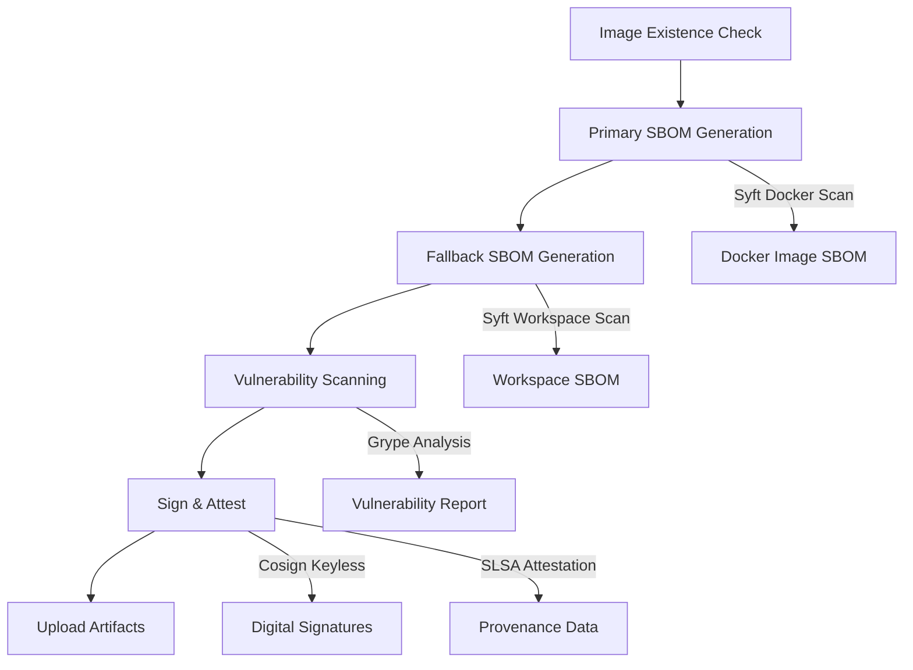
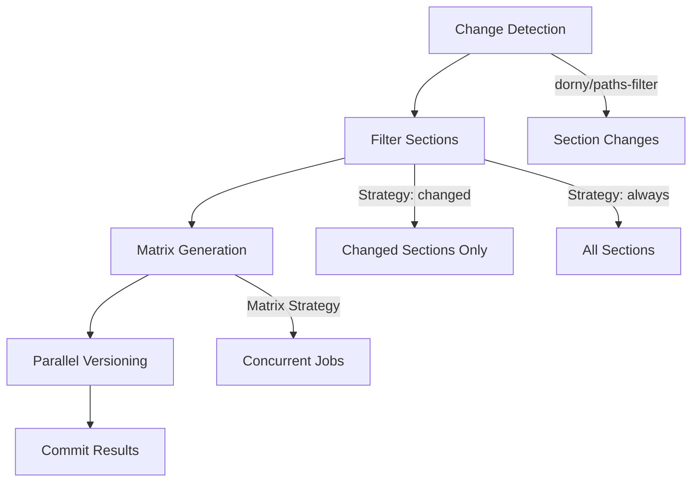

import TOCInline from '@theme/TOCInline';

# Reusable Workflows & Architecture


The slack-mcp-server CI/CD system is built on a foundation of reusable workflows that provide standardized operations across different contexts. This modular architecture promotes consistency, maintainability, and follows the DRY (Don't Repeat Yourself) principle.

<TOCInline toc={toc} />

## Architecture Overview

The reusable workflows architecture provides:

- **Modular Components**: Standardized operations that can be composed into complex workflows
- **Consistent Interfaces**: Unified parameter and output patterns across all components
- **Cross-Workflow Reuse**: Same components used in production, validation, and staging workflows
- **Centralized Logic**: Single source of truth for core operations
- **Enhanced Testing**: Isolated testing of individual workflow components

## Core Reusable Workflows

### 1. Docker Operations (`rw_docker_operations.yaml`)

**Purpose**: Standardized Docker image operations with consistent metadata outputs and comprehensive security scanning.

#### Operations

##### Build Operation (`build`)
```yaml
uses: ./.github/workflows/rw_docker_operations.yaml
with:
  operation: 'build'
  image-name: 'slack-mcp-server'
  image-tag: ${{ needs.bump_version.outputs.version }}
  push: true
  registry: 'ghcr.io'
```

**Features**:
- **Multi-Architecture Support**: Builds for amd64 and arm64 architectures
- **Registry Flexibility**: Supports Docker Hub, GHCR, and custom registries
- **Consistent Metadata**: Single source of truth for image names and tags
- **Buildx Integration**: Uses Docker Buildx for advanced build features

##### Test Operation (`test`)
```yaml
uses: ./.github/workflows/rw_docker_operations.yaml
with:
  operation: 'test'
  image-name: 'slack-mcp-server'
  image-tag: ${{ needs.build_docker.outputs.image-tag }}
```

**Features**:
- **Health Check Validation**: Verifies container starts and responds correctly
- **Functionality Testing**: Tests core application features within container
- **Port and Service Testing**: Validates exposed services and endpoints
- **Resource Usage Monitoring**: Checks memory and CPU consumption patterns

##### Security Scan Operation (`security-scan`)
```yaml
uses: ./.github/workflows/rw_docker_operations.yaml
with:
  operation: 'security-scan'
  image-name: 'slack-mcp-server'
  image-tag: ${{ needs.build_docker.outputs.image-tag }}
  enable-signing: true
```

**Enhanced Security Scanning Architecture**:



**Security Features**:
- **Defensive Image Checks**: Pre-flight validation that images exist before scanning
- **Dual SBOM Generation**: Primary Docker image scan with workspace fallback
- **Vulnerability Scanning**: Comprehensive CVE detection with Grype
- **Supply Chain Security**: Cosign signing and SLSA provenance attestation
- **Artifact Management**: Organized upload of security reports and signatures

#### Key Features

**Consistent Image Metadata**:
```yaml
outputs:
  image-name: ${{ jobs.operation.outputs.image-name }}
  image-tag: ${{ jobs.operation.outputs.image-tag }}
  image-digest: ${{ jobs.operation.outputs.image-digest }}
  image-ref: ${{ jobs.operation.outputs.image-ref }}
```

**Registry Agnostic Design**:
- Supports Docker Hub (`docker.io`)
- Supports GitHub Container Registry (`ghcr.io`)
- Configurable authentication methods
- Consistent tagging across registries

### 2. Documentation Operations (`rw_docs_operations.yaml`)

**Purpose**: Docusaurus documentation operations with advanced multi-section support and intelligent change detection.

#### Operations

##### Build Operation (`build`)
```yaml
uses: ./.github/workflows/rw_docs_operations.yaml
with:
  operation: 'build'
  node-version: '22'
  pnpm-version: '8'
```

**Features**:
- **Modern Tooling**: Uses pnpm for fast, efficient package management
- **Build Optimization**: Leverages pnpm cache for faster builds
- **Static Asset Generation**: Creates optimized production-ready documentation
- **PWA Support**: Generates Progressive Web App manifests and service workers

##### Test Operation (`test`)
```yaml
uses: ./.github/workflows/rw_docs_operations.yaml
with:
  operation: 'test'
  node-version: '22'
```

**Features**:
- **Build Validation**: Ensures documentation builds successfully
- **Link Checking**: Validates internal and external links
- **Performance Testing**: Checks build performance and asset sizes
- **Accessibility Testing**: Basic accessibility compliance checks

##### Version Operation (`version`)
```yaml
uses: ./.github/workflows/rw_docs_operations.yaml
with:
  operation: 'version'
  version: ${{ needs.bump_version.outputs.version }}
  sections: '["docs", "dev"]'
  strategy: 'changed'
```

**Enhanced Multi-Section Versioning**:



**Advanced Features**:
- **Section-Based Versioning**: Independent versioning for `docs`, `dev`, and `api` sections
- **Change Detection**: Automatic detection of changes per section using `dorny/paths-filter`
- **Matrix Processing**: Concurrent versioning jobs for optimal performance
- **Strategy Control**: Version all sections or only changed sections based on configuration

**Configuration Examples**:
```yaml
# Version only changed sections
sections: '["docs", "dev", "api"]'
strategy: 'changed'

# Version all sections regardless of changes  
sections: '["docs", "dev"]'
strategy: 'always'
```

##### Deploy Operations (`deploy-preview`, `deploy-production`)
```yaml
# Preview deployment
uses: ./.github/workflows/rw_docs_operations.yaml
with:
  operation: 'deploy-preview'
  preview-branch: 'docs-preview'

# Production deployment
uses: ./.github/workflows/rw_docs_operations.yaml
with:
  operation: 'deploy-production'
  github-pages: true
```

### 3. Python Package Operations (`rw_python_package.yaml`)

**Purpose**: Modern Python package building, testing, and publishing using `uv` toolchain.

#### Operations

##### Build Operation (`build`)
```yaml
uses: ./.github/workflows/rw_python_package.yaml
with:
  operation: 'build'
  python-version: '3.11'
```

**Features**:
- **UV Integration**: Uses `uv build` for fast, reliable package building
- **Lock File Management**: Automatic `uv.lock` synchronization during builds
- **Wheel and Source Distribution**: Generates both `.whl` and `.tar.gz` distributions
- **Build Artifact Management**: Organized artifact upload with consistent naming

##### Test Operation (`test`)
```yaml
uses: ./.github/workflows/rw_python_package.yaml
with:
  operation: 'test'
  python-version: '3.11'
  package-path: 'dist/*.whl'
```

**Features**:
- **Installation Testing**: Verifies package installs correctly in clean environment
- **Import Testing**: Validates all public modules can be imported
- **CLI Testing**: Tests command-line interfaces and entry points
- **Dependency Resolution**: Verifies dependency compatibility

##### Publish Operation (`publish`)
```yaml
uses: ./.github/workflows/rw_python_package.yaml
with:
  operation: 'publish'
  registry: 'pypi'  # or 'testpypi'
  oidc: true
```

**Features**:
- **OIDC Authentication**: Secure PyPI publishing with Trusted Publishers (no tokens required)
- **Registry Flexibility**: Supports PyPI, TestPyPI, and custom registries
- **UV Publish**: Uses `uv publish` for reliable, fast publishing
- **Retry Logic**: Automatic retry on transient failures

### 4. Git Operations (`rw_build_git-tag_and_create_github-release.yaml`)

**Purpose**: Standardized Git tagging and GitHub release creation with comprehensive metadata management.

#### Operations

##### Tag and Release Operation
```yaml
uses: ./.github/workflows/rw_build_git-tag_and_create_github-release.yaml
with:
  tag-version: ${{ needs.bump_version.outputs.version }}
  release-notes: ${{ needs.parse_intent.outputs.notes }}
  upload-assets: true
```

**Features**:
- **Semantic Versioning**: Creates properly formatted version tags
- **Release Notes**: Supports automated and custom release notes
- **Asset Management**: Uploads build artifacts to GitHub releases
- **Release Validation**: Ensures releases are created with correct metadata

## Workflow Integration Patterns

### Standard Integration Pattern

The reusable workflows follow a consistent integration pattern across all consuming workflows:

```yaml
jobs:
  operation-name:
    uses: ./.github/workflows/rw_operation_type.yaml
    with:
      operation: 'specific-operation'
      # Operation-specific parameters
    secrets: inherit
    # Optional permissions override
    permissions:
      contents: read
      packages: write
```

### Multi-Operation Workflows

Complex workflows often combine multiple reusable workflow operations:

```yaml
jobs:
  # Parse configuration
  parse_intent:
    uses: ./.github/workflows/rw_release_intent.yaml
    with:
      operation: 'parse'
  
  # Build Python package
  build_python:
    needs: [parse_intent]
    if: needs.parse_intent.outputs.python != 'skip'
    uses: ./.github/workflows/rw_python_package.yaml
    with:
      operation: 'build'
  
  # Build Docker image  
  build_docker:
    needs: [parse_intent]
    if: needs.parse_intent.outputs.docker != 'skip'
    uses: ./.github/workflows/rw_docker_operations.yaml
    with:
      operation: 'build'
      image-tag: ${{ needs.parse_intent.outputs.version }}
  
  # Security scanning
  scan_docker:
    needs: [build_docker]
    uses: ./.github/workflows/rw_docker_operations.yaml
    with:
      operation: 'security-scan'
      image-tag: ${{ needs.build_docker.outputs.image-tag }}
```

### Conditional Execution Patterns

Reusable workflows support sophisticated conditional execution based on configuration and change detection:

```yaml
jobs:
  # Conditional Python publishing
  publish_python:
    needs: [parse_intent, build_python]
    if: |
      needs.parse_intent.outputs.python == 'force' ||
      (needs.parse_intent.outputs.python == 'auto' && needs.detect_changes.outputs.python == 'true')
    uses: ./.github/workflows/rw_python_package.yaml
    with:
      operation: 'publish'
      registry: 'pypi'
```

## Architecture Benefits

### DRY Principle Implementation

**Before Reusable Workflows**:
- Docker build logic duplicated across 5+ workflows
- Inconsistent parameter handling
- Divergent security scanning implementations
- Maintenance burden across multiple files

**With Reusable Workflows**:
- Single source of truth for each operation type
- Consistent interfaces and behavior
- Centralized security and quality improvements
- Simplified maintenance and updates

### Consistency Guarantees

**Standardized Operations**:
- All Docker operations use identical build settings
- Security scanning follows the same comprehensive process
- Documentation operations maintain consistent build environments
- Python package operations use unified tooling and authentication

**Unified Outputs**:
```yaml
# All reusable workflows provide consistent output format
outputs:
  success: ${{ jobs.operation.outputs.success }}
  operation-specific-data: ${{ jobs.operation.outputs.data }}
  artifacts: ${{ jobs.operation.outputs.artifacts }}
```

### Enhanced Maintainability

**Centralized Logic**:
- Security improvements benefit all workflows automatically
- Tool upgrades require changes in single location
- Bug fixes propagate across entire system
- New features available to all consuming workflows

**Version Management**:
- Reusable workflows use semantic versioning (e.g., `@v7.3`)
- Breaking changes managed through version bumps
- Backward compatibility maintained for stable versions
- Clear upgrade paths for major versions

### Improved Testing

**Component Isolation**:
- Each reusable workflow can be tested independently
- Unit testing of individual operations
- Integration testing of workflow compositions
- Simplified debugging and troubleshooting

**Validation Workflows**:
- Dedicated validation for each reusable component
- Comprehensive testing matrix across different configurations
- Automated testing of reusable workflow upgrades

## Configuration Management

### Parameter Standardization

All reusable workflows follow consistent parameter naming conventions:

```yaml
# Standard parameters across all workflows
inputs:
  operation:
    description: 'Operation to perform'
    required: true
    type: string
  
  # Operation-specific parameters follow kebab-case naming
  image-name:
    description: 'Docker image name'
    type: string
  
  python-version:
    description: 'Python version for operations'
    type: string
    default: '3.11'
```

### Secret Management

**Inherited Secrets Pattern**:
```yaml
# Consuming workflows pass all secrets to reusable workflows
secrets: inherit
```

**Selective Secret Passing**:
```yaml
# When fine-grained control is needed
secrets:
  DOCKERHUB_USERNAME: ${{ secrets.DOCKERHUB_USERNAME }}
  DOCKERHUB_TOKEN: ${{ secrets.DOCKERHUB_TOKEN }}
```

### Permission Management

**Standard Permissions**:
```yaml
permissions:
  contents: read        # Repository access
  packages: write       # Registry publishing
  id-token: write      # OIDC authentication
  actions: read        # Artifact access
```

## Best Practices

### For Workflow Developers

1. **Operation Granularity**: Design operations that are focused and composable
2. **Parameter Validation**: Include comprehensive input validation
3. **Error Handling**: Provide clear error messages and fail-fast behavior
4. **Output Consistency**: Follow standard output patterns across all operations
5. **Documentation**: Maintain clear parameter and usage documentation

### For Workflow Consumers

1. **Version Pinning**: Use specific versions (e.g., `@v7.3`) rather than `@main`
2. **Parameter Validation**: Validate inputs before passing to reusable workflows
3. **Conditional Logic**: Use appropriate conditions for optional operations
4. **Secret Management**: Follow principle of least privilege for secret access
5. **Error Propagation**: Handle reusable workflow failures appropriately

### Upgrade Management

**Version Upgrade Process**:
1. **Test New Versions**: Validate new reusable workflow versions in staging
2. **Gradual Rollout**: Update consuming workflows incrementally
3. **Monitor Results**: Track success rates and performance metrics
4. **Rollback Plan**: Maintain ability to quickly revert to previous versions

## Performance Optimization

### Parallel Execution

**Matrix Strategies**:
```yaml
# Reusable workflows support matrix execution for parallel processing
strategy:
  matrix:
    section: [docs, dev, api]
    
uses: ./.github/workflows/rw_docs_operations.yaml
with:
  operation: 'version'
  section: ${{ matrix.section }}
```

### Caching Strategies

**Build Caching**:
- Docker layer caching for faster image builds
- pnpm cache for faster Node.js builds
- Python package cache for faster installs
- Artifact caching between workflow runs

### Resource Management

**Efficient Resource Usage**:
- Appropriate runner sizes for different operations
- Timeout configurations to prevent runaway processes
- Cleanup procedures for temporary artifacts
- Optimized artifact retention policies

---

🔗 **Related Documentation**:
- [Release System](./release-system.mdx) - See how reusable workflows compose into release pipelines
- [Continuous Integration](./continuous-integration.mdx) - Understanding CI workflow usage
- [Developer Guide](./developer-guide.mdx) - Advanced configuration and troubleshooting
