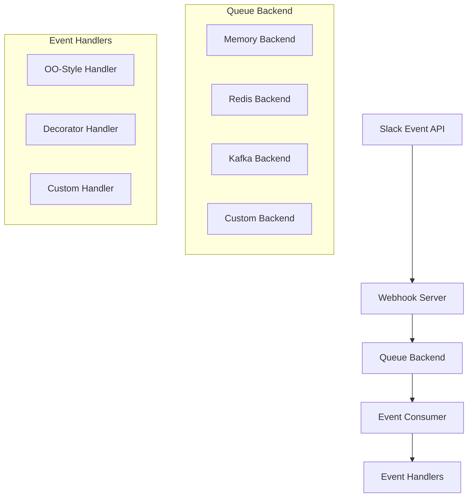

# Event Handlers & Queue Architecture

The Slack MCP server provides a robust event handling system that allows developers to process Slack events using a queue-based architecture. This system decouples event reception from event processing, enabling scalable and flexible event handling patterns.

## Architecture Overview

The event handling system consists of four main components:



### Component Responsibilities

1. **Webhook Server** ([`slack_mcp/webhook/server.py`](https://github.com/Chisanan232/slack-mcp-server/blob/master/slack_mcp/webhook/server.py)) - Receives events from Slack and publishes them to a queue
2. **Queue Backend** ([`slack_mcp/backends/`](https://github.com/Chisanan232/slack-mcp-server/tree/master/slack_mcp/backends)) - Stores and distributes events to consumers
3. **Event Consumer** ([`slack_mcp/webhook/event/consumer.py`](https://github.com/Chisanan232/slack-mcp-server/blob/master/slack_mcp/webhook/event/consumer.py)) - Consumes events from the queue and routes them to handlers
4. **Event Handlers** ([`slack_mcp/webhook/event/handler/`](https://github.com/Chisanan232/slack-mcp-server/tree/master/slack_mcp/webhook/event/handler)) - Process individual Slack events

## Event Flow

1. **Reception**: Slack sends events to the webhook server endpoint (`/slack/events`)
2. **Validation**: The server verifies the request signature and handles URL verification
3. **Publishing**: Events are published to the configured queue backend with topic `slack_events`
4. **Consumption**: [`SlackEventConsumer`](https://github.com/Chisanan232/slack-mcp-server/blob/master/slack_mcp/webhook/event/consumer.py#L25-L103) reads events from the queue
5. **Routing**: Events are routed to appropriate handlers based on type and subtype
6. **Processing**: Handler methods process the events according to your business logic

## Queue Backend System

### Protocol Interface

All queue backends implement the [`QueueBackend`](https://github.com/Chisanan232/slack-mcp-server/blob/master/slack_mcp/backends/base/protocol.py#L11-L51) protocol defined in [`slack_mcp/backends/base/protocol.py`](https://github.com/Chisanan232/slack-mcp-server/blob/master/slack_mcp/backends/base/protocol.py):

```python
@runtime_checkable
class QueueBackend(Protocol):
    async def publish(self, key: str, payload: Dict[str, Any]) -> None:
        """Publish a message to the queue."""
        ...

    async def consume(self, *, group: Optional[str] = None) -> AsyncIterator[Dict[str, Any]]:
        """Consume messages from the queue."""
        ...

    @classmethod
    def from_env(cls) -> "QueueBackend":
        """Create a backend instance from environment variables."""
        ...
```

### Built-in Backends

#### Memory Backend
- **Purpose**: Development and testing only
- **Features**: In-process asyncio.Queue storage
- **Limitations**: Messages lost on restart, single-process only
- **Configuration**: No environment variables required

```python
# Usage
from slack_mcp.backends.queue.memory import MemoryBackend
backend = MemoryBackend.from_env()
```

**Reference**: [`MemoryBackend`](https://github.com/Chisanan232/slack-mcp-server/blob/master/slack_mcp/backends/queue/memory.py#L21-L107)

### Backend Selection

The system automatically selects backends using this priority:

1. **Explicit**: Use `QUEUE_BACKEND` environment variable
2. **Auto-discovery**: First non-memory backend from entry points
3. **Fallback**: Memory backend with warning

```bash
# Explicit backend selection
export QUEUE_BACKEND=redis
```

### Developing Custom Queue Backends

#### 1. Implement the Protocol

Create a new backend by implementing the [`QueueBackend`](https://github.com/Chisanan232/slack-mcp-server/blob/master/slack_mcp/backends/base/protocol.py#L11-L51) protocol:

```python
from slack_mcp.backends.base.protocol import QueueBackend
from typing import Any, AsyncIterator, Dict, Optional
import os

class MyCustomBackend(QueueBackend):
    def __init__(self, connection_string: str):
        self.connection_string = connection_string
        # Initialize your backend connection

    async def publish(self, key: str, payload: Dict[str, Any]) -> None:
        # Implement message publishing
        # key: routing key or topic name
        # payload: the Slack event data
        pass

    async def consume(self, *, group: Optional[str] = None) -> AsyncIterator[Dict[str, Any]]:
        # Implement message consumption
        # group: consumer group for load balancing (if supported)
        while True:
            # Yield messages as they arrive
            yield await self._get_next_message()

    @classmethod
    def from_env(cls) -> "MyCustomBackend":
        connection_string = os.environ.get("MY_BACKEND_URL", "")
        if not connection_string:
            raise ValueError("MY_BACKEND_URL environment variable required")
        return cls(connection_string)
```

#### 2. Package as Plugin

Create a Python package with entry point configuration:

```toml
# pyproject.toml
[project.entry-points."slack_mcp.backends.queue"]
my_backend = "my_package.backend:MyCustomBackend"
```

#### 3. Installation & Usage

```bash
# Install your backend package
pip install my-slack-backend

# Configure environment
export QUEUE_BACKEND=my_backend
export MY_BACKEND_URL=my://connection-string

# Backend will be auto-discovered and used
```

## Consumer System

### AsyncLoopConsumer

The base consumer implementation ([`AsyncLoopConsumer`](https://github.com/Chisanan232/slack-mcp-server/blob/master/slack_mcp/backends/base/consumer.py#L41-L118) in [`slack_mcp/backends/base/consumer.py`](https://github.com/Chisanan232/slack-mcp-server/blob/master/slack_mcp/backends/base/consumer.py)) provides:

- **Async Processing**: Uses `asyncio` for concurrent event handling
- **Error Handling**: Continues processing on individual event errors
- **Graceful Shutdown**: Handles task cancellation properly

### SlackEventConsumer

The Slack-specific consumer ([`SlackEventConsumer`](https://github.com/Chisanan232/slack-mcp-server/blob/master/slack_mcp/webhook/event/consumer.py#L25-L103) in [`slack_mcp/webhook/event/consumer.py`](https://github.com/Chisanan232/slack-mcp-server/blob/master/slack_mcp/webhook/event/consumer.py)) extends the base consumer with:

- **Event Routing**: Routes events to appropriate handler methods
- **Handler Integration**: Works with both OO-style and decorator-style handlers
- **Logging**: Comprehensive logging for debugging and monitoring

## Event Handler Development

### Handler Styles

The system supports two main handler development patterns:

#### 1. OO-Style Handlers

Inherit from [`BaseSlackEventHandler`](https://github.com/Chisanan232/slack-mcp-server/blob/master/slack_mcp/webhook/event/handler/base.py#L41-L473) and override methods for specific events:

```python
from slack_mcp.webhook.event.handler.base import BaseSlackEventHandler
from typing import Dict, Any

class MySlackHandler(BaseSlackEventHandler):
    async def on_message(self, event: Dict[str, Any]) -> None:
        """Handle all message events."""
        text = event.get('text', '')
        print(f"Message received: {text}")
    
    async def on_message__channels(self, event: Dict[str, Any]) -> None:
        """Handle message.channels events specifically."""
        channel = event.get('channel')
        text = event.get('text', '')
        print(f"Channel message in {channel}: {text}")
    
    async def on_reaction_added(self, event: Dict[str, Any]) -> None:
        """Handle reaction_added events."""
        reaction = event.get('reaction', '')
        print(f"Reaction added: :{reaction}:")
    
    async def on_unknown(self, event: Dict[str, Any]) -> None:
        """Handle unknown event types."""
        event_type = event.get('type', 'unknown')
        print(f"Unknown event: {event_type}")
```

**Method Naming Convention:**
- `on_{type}()` - Handle events by type (e.g., `on_message`)
- `on_{type}__{subtype}()` - Handle events by type + subtype (e.g., `on_message__channels`)

#### 2. Decorator-Style Handlers

Use the [`DecoratorHandler`](https://github.com/Chisanan232/slack-mcp-server/blob/master/slack_mcp/webhook/event/handler/decorator.py) class with decorators:

```python
from slack_mcp.webhook.event.handler.decorator import DecoratorHandler
from slack_mcp.events import SlackEvent
from typing import Dict, Any

# Create handler instance
handler = DecoratorHandler()

# Attribute-style decorators
@handler.message
async def handle_message(event: Dict[str, Any]) -> None:
    text = event.get('text', '')
    print(f"Message: {text}")

@handler.reaction_added
async def handle_reaction(event: Dict[str, Any]) -> None:
    reaction = event.get('reaction', '')
    print(f"Reaction: :{reaction}:")

# Enum-style decorators
@handler(SlackEvent.APP_MENTION)
async def handle_app_mention(event: Dict[str, Any]) -> None:
    text = event.get('text', '')
    print(f"App mentioned: {text}")

# Subtype handling
@handler("message.channels")
async def handle_channel_message(event: Dict[str, Any]) -> None:
    channel = event.get('channel')
    print(f"Channel message in: {channel}")

# Wildcard handler (receives all events)
@handler
async def log_all_events(event: Dict[str, Any]) -> None:
    event_type = event.get('type')
    print(f"Event received: {event_type}")
```

### Setting Up Event Processing

#### Complete Example

```python
import asyncio
import logging
from slack_mcp.backends.loader import load_backend
from slack_mcp.webhook.event.consumer import SlackEventConsumer
from slack_mcp.webhook.event.handler.base import BaseSlackEventHandler

# Configure logging
logging.basicConfig(level=logging.INFO)
logger = logging.getLogger(__name__)

class MyEventHandler(BaseSlackEventHandler):
    async def on_message(self, event):
        logger.info(f"Message: {event.get('text', '')}")
    
    async def on_reaction_added(self, event):
        logger.info(f"Reaction: {event.get('reaction', '')}")

async def main():
    # Load queue backend from environment
    backend = load_backend()  # See: https://github.com/Chisanan232/slack-mcp-server/blob/master/slack_mcp/backends/loader.py#L18-L70
    
    # Create event handler
    handler = MyEventHandler()
    
    # Create and start consumer
    consumer = SlackEventConsumer(backend, handler)
    
    try:
        logger.info("Starting event consumer...")
        await consumer.run()
    except KeyboardInterrupt:
        logger.info("Shutting down...")
        await consumer.shutdown()

if __name__ == "__main__":
    asyncio.run(main())
```

## Advanced Usage Patterns

### Multiple Handler Instances

You can create multiple isolated handler instances for different purposes:

```python
# Main business logic handler
business_handler = DecoratorHandler()

@business_handler.message
async def process_business_logic(event):
    # Your main application logic
    pass

# Analytics handler
analytics_handler = DecoratorHandler()

@analytics_handler.message  
async def track_message_metrics(event):
    # Track metrics and analytics
    pass

# Create separate consumers
business_consumer = SlackEventConsumer(backend, business_handler, group="business")
analytics_consumer = SlackEventConsumer(backend, analytics_handler, group="analytics")
```

### Error Handling Strategies

#### Individual Handler Errors
```python
@handler.message
async def handle_message_with_error_handling(event):
    try:
        # Your processing logic
        risky_operation(event)
    except SpecificError as e:
        logger.error(f"Specific error in message handler: {e}")
        # Handle gracefully
    except Exception as e:
        logger.exception(f"Unexpected error in message handler: {e}")
        # Don't re-raise - let other handlers continue
```

#### Consumer-Level Error Handling
The [`SlackEventConsumer`](https://github.com/Chisanan232/slack-mcp-server/blob/master/slack_mcp/webhook/event/consumer.py#L25-L103) automatically catches and logs handler exceptions, ensuring that one failing handler doesn't crash the entire consumer.

### Handler Priorities

For decorator-style handlers, you can specify priorities:

```python
@handler.message(priority=0)  # Called first
async def high_priority_handler(event):
    # Critical processing
    pass

@handler.message(priority=10)  # Called later
async def low_priority_handler(event):
    # Secondary processing
    pass
```

### Return Values and Processing Pipelines

Handlers can return values for processing pipelines:

```python
@handler.message
async def enrich_message(event):
    # Enrich the event data
    enriched_data = {
        'original': event,
        'processed_at': datetime.utcnow(),
        'sentiment': analyze_sentiment(event.get('text', ''))
    }
    return enriched_data
```

## Configuration

### Environment Variables

| Variable | Description | Default |
|----------|-------------|---------|
| `QUEUE_BACKEND` | Backend type (memory, redis, kafka, etc.) | Auto-detect |
| `SLACK_EVENTS_TOPIC` | Queue topic for Slack events | `slack_events` |

Backend-specific variables depend on the chosen backend implementation.

### Consumer Groups

For backends that support consumer groups (like Kafka), you can specify groups:

```python
consumer = SlackEventConsumer(
    backend=backend, 
    handler=handler, 
    group="my-consumer-group"
)
```

This enables load balancing across multiple consumer instances.

## Monitoring and Debugging

### Logging

The system provides comprehensive logging at different levels:

```python
import logging

# Enable debug logging for detailed event flow
logging.getLogger('slack_mcp.webhook.event').setLevel(logging.DEBUG)

# Enable info logging for general operation
logging.getLogger('slack_mcp.backends').setLevel(logging.INFO)
```

### Health Checks

Monitor your event processing system using the webhook server's health endpoint:

```bash
curl http://localhost:8000/health
```

Response includes queue backend status and component health.

### Event Inspection

Use the handler's inspection methods to understand registered handlers:

```python
# For decorator-style handlers
handlers = my_handler.get_handlers()
print(f"Registered event types: {list(handlers.keys())}")
print(f"Message handlers count: {len(handlers.get('message', []))}")
```

## Best Practices

### Handler Design
- **Keep handlers focused**: One responsibility per handler method
- **Handle errors gracefully**: Don't let exceptions crash the consumer
- **Use appropriate logging levels**: INFO for business events, DEBUG for technical details
- **Consider idempotency**: Events might be processed multiple times

### Performance
- **Use async handlers**: Avoid blocking operations in handlers
- **Batch operations**: Group related operations when possible
- **Monitor queue depth**: Ensure consumers keep up with event volume

### Testing
- **Use MemoryBackend for tests**: Fast and reliable for unit testing
- **Mock external services**: Don't make real API calls in tests
- **Test error scenarios**: Verify graceful error handling

### Production Deployment
- **Use external queue backends**: Redis, Kafka, or cloud-based solutions
- **Configure consumer groups**: Enable load balancing across instances
- **Monitor queue metrics**: Track processing latency and error rates
- **Implement dead letter queues**: Handle permanently failed messages

## Examples Repository

Complete working examples are available in the [`/examples/event_handler/`](https://github.com/Chisanan232/slack-mcp-server/tree/master/examples/event_handler) directory:

- [`decorator_handler_example.py`](https://github.com/Chisanan232/slack-mcp-server/blob/master/examples/event_handler/decorator_handler_example.py) - Comprehensive decorator-style usage
- [`slack_event_handlers.py`](https://github.com/Chisanan232/slack-mcp-server/blob/master/examples/event_handler/slack_event_handlers.py) - Multiple handler patterns
- [`advanced_slack_handlers.py`](https://github.com/Chisanan232/slack-mcp-server/blob/master/examples/event_handler/advanced_slack_handlers.py) - Production-ready examples with error handling

These examples demonstrate real-world usage patterns and can serve as starting points for your own event handling implementations.
