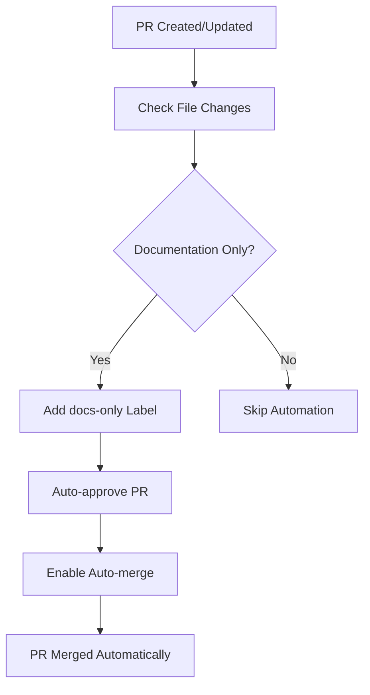

import TOCInline from '@theme/TOCInline';

# Developer Guide & Additional Workflows


This guide provides comprehensive information for developers working with the slack-mcp-server CI/CD system, including troubleshooting, configuration management, specialized workflows, and best practices.

<TOCInline toc={toc} />

## Using the Release System

### Configuring a Release

Edit `.github/tag_and_release/intent.yaml` to configure your release:

```yaml
# Example: Patch release with selective docs versioning
release: true
level: "patch"
artifacts:
  python: "auto"
  docker: "auto"
  docs:
    mode: "auto"
    sections: ["docs", "dev"]  # Only version docs and dev sections
    strategy: "changed"        # Only version if changes detected
notes: "Patch release with selective documentation versioning"
```

### Triggering Releases

#### Automatic Release (Push to master)
```bash
git push origin master
# Triggers release workflow automatically
```

#### Manual Release (GitHub UI)
1. Go to Actions → Release
2. Click "Run workflow"
3. Optionally override intent configuration

#### Manual Release (CLI)
```bash
# Trigger release workflow manually
gh workflow run release.yml

# Trigger with custom parameters
gh workflow run release.yml \
  --field release=true \
  --field level=patch \
  --field notes="Manual patch release"
```

### Pre-Release Validation

#### For Pull Requests
- Release validation runs automatically on PRs to master
- Provides comprehensive validation without publishing
- Reviews security scan results and vulnerability reports

#### Manual Validation
```bash
# Trigger validation workflow manually
gh workflow run release-validate.yml

# Check validation status
gh run list --workflow=release-validate.yml --limit=5
```

### Staging Releases

#### Deploy to Staging
```bash
# Manual staging release
gh workflow run release-staging.yml

# Check staging status
gh run list --workflow=release-staging.yml --limit=3
```

#### Staging Artifacts
- **TestPyPI**: `pip install -i https://test.pypi.org/simple/ slack-mcp-server`
- **GHCR Staging**: `docker pull ghcr.io/chisanan232/slack-mcp-server:1.0.0-rc.0`
- **Preview Docs**: Available on docs-preview branch

## Common Workflows

### Release Preparation

1. **Update Code**: Make your changes and ensure tests pass
2. **Configure Intent**: Set release configuration in `intent.yaml`
3. **Validate**: Create PR and review validation results
4. **Stage** (Optional): Test in staging environment
5. **Release**: Merge to master for automatic release

### Hotfix Release Process

```bash
# 1. Create hotfix branch from master
git checkout master
git checkout -b hotfix/critical-fix

# 2. Make necessary changes
# ... make fixes ...

# 3. Configure for patch release
cat > .github/tag_and_release/intent.yaml << EOF
release: true
level: patch
artifacts:
  python: force
  docker: force
  docs: skip
notes: "Hotfix: Critical security vulnerability"
EOF

# 4. Commit and push
git add .
git commit -m "fix: critical security vulnerability"
git push origin hotfix/critical-fix

# 5. Create PR and validate
gh pr create --title "Hotfix: Critical security fix" --body "Emergency patch release"

# 6. After validation passes, merge to master
gh pr merge --merge
```

### Feature Release Process

```bash
# 1. Develop feature in branch
git checkout -b feature/new-capability

# 2. After development, configure for minor release
cat > .github/tag_and_release/intent.yaml << EOF
release: true
level: minor
artifacts:
  python: auto
  docker: auto
  docs:
    mode: auto
    sections: ["docs", "dev"]
    strategy: changed
notes: "New feature: Enhanced API capabilities"
EOF

# 3. Create PR for validation
gh pr create --title "feat: new API capabilities" --body "Adds new features with docs"

# 4. Test in staging first
gh workflow run release-staging.yml

# 5. After staging validation, merge to master
gh pr merge --merge
```

## Troubleshooting

### Git Synchronization Issues

**Symptoms**: Artifacts built with old version (0.0.0) instead of bumped version (0.0.1)

**Root Cause**: Downstream jobs used `actions/checkout@v5` without `ref` parameter, defaulting to original commit SHA instead of latest commit with version bump.

**Solution Applied**: All workflows now use `ref: ${{ github.ref_name }}` to checkout latest branch state.

**Fixed Workflows**:
- `rw_python_package.yaml` - Python package operations
- `rw_docker_operations.yaml` - Docker image operations  
- `rw_docs_operations.yaml` - Documentation operations
- `rw_build_git-tag_and_create_github-release.yaml` - Git tagging
- `release-staging.yml` - Staging releases

**Impact**: Python packages, Docker images, and docs now use correct bumped version

### UV Lock File Synchronization

**Enhancement**: Version bump now automatically updates `uv.lock` file to maintain dependency synchronization

**Process**:
1. After `uv version --bump`, the workflow runs `uv lock` to update lock file
2. Both `pyproject.toml` and `uv.lock` are committed together in version bump
3. Ensures dependency lock file stays in sync with version changes

### Documentation Versioning Issues

**Problem**: Documentation not updating after release
**Solutions**:
- Verify `sections` configuration matches actual docs structure
- Use `strategy: "always"` to force versioning regardless of changes  
- Check that Docusaurus plugin IDs in `sections` array exist in `docusaurus.config.ts`

**Problem**: Guard job failing
**Solutions**:
- Check that release workflow uploaded the `release-docs-flag` artifact
- Verify artifact download permissions are correct
- Ensure workflow run ID is accessible

### Intent Configuration Issues

**Validation**: Configuration is validated against JSON schema during parsing
**Error Handling**: Invalid configurations fail with descriptive error messages  
**Testing**: Use `release-validate.yml` workflow to test configuration changes

### Common Configuration Mistakes

#### 1. Incorrect Section Names
```yaml
# ❌ Wrong - section doesn't exist
docs:
  sections: ["documentation", "developer"]

# ✅ Correct - matches Docusaurus config
docs:
  sections: ["docs", "dev"]
```

#### 2. Conflicting Mode and Strategy
```yaml
# ❌ Confusing - mode skip overrides strategy
docs:
  mode: skip
  strategy: always  # This has no effect

# ✅ Clear intent
docs:
  mode: auto
  strategy: always
```

#### 3. Legacy vs Enhanced Format Mixing
```yaml
# ❌ Wrong - can't mix formats
docs: auto
docs:
  sections: ["docs"]

# ✅ Choose one format consistently
docs:
  mode: auto
  sections: ["docs", "dev"]
  strategy: changed
```

### Tag Mismatch Issues

**Diagnosis**:
- Check that Docker build and security scan jobs use consistent tags
- Validation workflow includes defensive checks to catch this early

**Solutions**:
```bash
# Verify tag consistency across jobs
gh run view <run-id> --log | grep -E "(image-tag|docker tag)"
```

### SBOM Generation Failures

**Fallback Mechanism**: System includes fallback SBOM generation from workspace
**Debugging**: Check security scan artifacts for detailed logs

**Common Issues**:
- Docker image not accessible for scanning
- Syft version compatibility
- Workspace permission issues

## Monitoring Releases

### Release Status Monitoring

**Primary Workflows**:
- [Release Workflow](https://github.com/Chisanan232/slack-mcp-server/actions/workflows/release.yml)
- [Validation Results](https://github.com/Chisanan232/slack-mcp-server/actions/workflows/release-validate.yml)

**CLI Monitoring**:
```bash
# Monitor active release
gh run list --workflow=release.yml --limit=1

# Check specific run
gh run view <run-id>

# Monitor in real-time
gh run watch <run-id>
```

### Security Reports

**Review Process**:
- Review vulnerability scan results in workflow summaries
- Download security artifacts for detailed analysis
- Monitor CVE reports and remediation recommendations

**Artifact Access**:
```bash
# Download security artifacts
gh run download <run-id> --name security-reports

# View SBOM
cat sbom.spdx.json | jq '.packages[] | select(.name | contains("critical"))'
```

### Artifact Verification

#### Python Package (PyPI)
```bash
# Check package availability and correct version
pip install slack-mcp-server==<VERSION>
python -c "import slack_mcp; print(slack_mcp.__version__)"
```

#### Docker Hub
```bash
# Verify Docker image availability and correct version tags
docker pull chisanan232/slack-mcp-server:<VERSION>
docker run --rm chisanan232/slack-mcp-server:<VERSION> --version
```

#### GitHub Container Registry (GHCR)
```bash
# Verify Docker image availability and correct version tags
docker pull ghcr.io/chisanan232/slack-mcp-server:<VERSION>
docker run --rm ghcr.io/chisanan232/slack-mcp-server:<VERSION> --version
```

#### Documentation
```bash
# Check versioned documentation is available
curl -s https://chisanan232.github.io/slack-mcp-server/docs/<VERSION>/
```

#### Version Consistency Verification
All artifacts should reflect the same bumped version:
- Verify Python package, both Docker registries, and docs use identical version tags
- Cross-check that no artifacts still reference the old version (e.g., 0.0.0 vs 0.0.1)

## Additional CI Workflows

The project includes several specialized CI workflows that complement the main CI/CD pipeline:

### Docker CI

[](https://github.com/Chisanan232/slack-mcp-server/actions/workflows/docker-ci.yml)

**Purpose**: Standalone Docker image building and functionality testing

**Features**:
- Independent Docker image testing
- Multi-architecture build validation
- Container functionality verification  
- Performance and resource usage testing

**Use Cases**:
- Testing Docker changes without full release
- Validating Dockerfile modifications
- Performance regression testing

### DockerHub README CI

[](https://github.com/Chisanan232/slack-mcp-server/actions/workflows/dockerhub-readme-ci.yml)

**Purpose**: Updates the Docker Hub repository description automatically

**Features**:
- Synchronizes README content with Docker Hub
- Maintains consistent documentation across platforms
- Automatic updates on documentation changes

**Benefits**:
- Keeps Docker Hub page current with latest documentation
- Reduces manual maintenance overhead
- Ensures users see accurate information

### Documentation Auto-Approve & Auto-Merge

[](https://github.com/Chisanan232/slack-mcp-server/actions/workflows/docs-automerge.yml)

**Purpose**: Streamlines documentation-only pull request processing

#### Features

**1. Identifying Documentation-Only Changes**:
- Uses path filtering to detect changes limited to documentation files
- Checks that no code, configuration, or infrastructure files are modified
- Validates PR scope to ensure safety of automated processing

**2. Automatic Processing**:
- Adds a "📝 docs-only" label to qualifying PRs
- Automatically approves the PR with a review comment
- Enables auto-merge functionality (merge commit)

#### Workflow Process



#### Requirements for Auto-Merge

**Repository Settings**:
- Repository must have "Allow auto-merge" enabled in settings
- Repository must have "Allow GitHub Actions to create and approve pull requests" enabled

**PR Requirements**:
- PR must not be in draft state
- Changes must be limited to documentation files
- All other CI checks must pass

**Benefits**:
- Reduces maintenance burden for documentation-focused contributions
- Maintains proper review processes for code changes
- Accelerates documentation improvement cycle

### Legacy Continuous Deployment

:::info Legacy System
The following describes the legacy CD system (`cd.yaml`) which is maintained for backward compatibility but superseded by the release system above.
:::

[](https://github.com/Chisanan232/slack-mcp-server/actions/workflows/cd.yaml)

**Purpose**: Legacy CD workflow for backward compatibility

**Features**:
- Triggered by changes to `__pkg_info__.py` files
- Basic version checking and Git tagging  
- PyPI publication and Docker Hub publishing
- Simplified workflow for basic deployment needs

## CI/CD Configuration Files

All CI/CD workflows are defined in the `.github/workflows/` directory:

### Core Workflows
- `ci.yaml` - Main CI workflow with comprehensive testing
- `release.yml` - Modern intent-driven release system
- `release-validate.yml` - Pre-release validation workflow  
- `release-staging.yml` - Staging environment deployment
- `documentation.yaml` - Documentation building and deployment

### Reusable Workflows
- `rw_docker_operations.yaml` - Docker build, test, and security operations
- `rw_docs_operations.yaml` - Documentation build, version, and deploy operations
- `rw_python_package.yaml` - Python package build, test, and publish operations
- `rw_build_git-tag_and_create_github-release.yaml` - Git tagging and GitHub releases

### Specialized Workflows  
- `check-slack-api-spec.yaml` - API specification validation
- `docker-ci.yml` - Standalone Docker testing
- `dockerhub-readme-ci.yml` - DockerHub README synchronization
- `docs-automerge.yml` - Documentation PR automation

### Legacy Workflows
- `cd.yaml` - Legacy continuous deployment (backward compatibility)

**Browse All Workflows**: [Workflow Definitions](https://github.com/Chisanan232/slack-mcp-server/tree/master/.github/workflows)

## Best Practices for Contributors

### Development Workflow

#### 1. Pre-Submission Testing
```bash
# Run tests locally before submitting PR
uv run pytest
uv run mypy slack_mcp/
uv run ruff check slack_mcp/

# Test Docker build locally
docker build -t test-image .
docker run --rm test-image --version
```

#### 2. CI/CD Integration
- **Monitor CI Results**: Check CI status on PRs immediately after submission
- **Address Failures Promptly**: Fix failing tests or code quality issues quickly
- **Use Validation Workflows**: Run `release-validate.yml` to test release changes

#### 3. Documentation Standards
- **Update Documentation**: Keep docs in sync with code changes
- **Test Documentation Builds**: Verify docs build successfully locally
- **Use Auto-merge**: Leverage docs-only PR automation for pure documentation changes

### Configuration Management

#### 4. Release Configuration
```yaml
# Conservative approach (recommended)
release: true
level: auto  # Let commit messages determine bump level
artifacts:
  python: auto  # Only publish if Python files changed
  docker: auto  # Only publish if Docker files changed
  docs:
    mode: auto
    strategy: changed  # Only version changed doc sections
```

#### 5. Testing Strategy
- **Staging First**: Use staging releases for major changes
- **Validation Always**: Run validation on all PRs to master
- **Security Reviews**: Monitor security scan results regularly

### Quality Assurance

#### 6. Code Quality
- **Maintain Test Coverage**: Add tests for new features to maintain high coverage
- **Follow Code Standards**: Use consistent formatting and linting
- **Document APIs**: Keep API documentation current with implementation

#### 7. Security Practices
- **Review Vulnerability Reports**: Address security findings promptly
- **Update Dependencies**: Keep dependencies current for security patches
- **Validate Artifacts**: Verify published artifacts work as expected

### Collaboration Guidelines

#### 8. Pull Request Best Practices
- **Clear Descriptions**: Provide comprehensive PR descriptions
- **Small Focused Changes**: Keep PRs focused on specific improvements
- **Test Instructions**: Include testing steps for reviewers

#### 9. Issue Management
- **Reproducible Examples**: Provide clear reproduction steps for bugs
- **Feature Requests**: Include use cases and implementation suggestions
- **Documentation Issues**: Tag with appropriate labels for quick processing

### Performance Optimization

#### 10. Workflow Efficiency
- **Cache Usage**: Leverage caching for faster builds
- **Parallel Jobs**: Use matrix strategies for parallel testing
- **Resource Management**: Choose appropriate runner sizes for different jobs

---

🔗 **Related Documentation**:
- [Release System](./release-system.mdx) - Comprehensive release workflow configuration
- [Documentation Deployment](./documentation-deployment.mdx) - Documentation workflow architecture
- [Reusable Workflows](./reusable-workflows.mdx) - Understanding the modular workflow components
- [CI/CD Overview](./index.mdx) - Navigate to other CI/CD documentation sections
