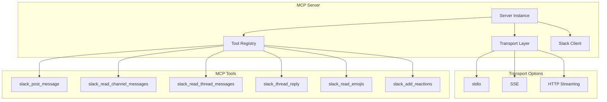
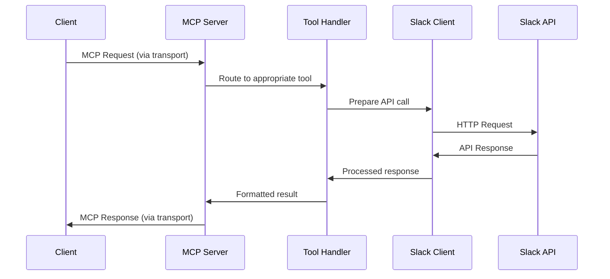

# MCP Server Architecture

The MCP (Model Context Protocol) Server is the core component that enables AI assistants and clients to interact with Slack through a standardized protocol. This document details the architecture, components, and implementation of the MCP server.

## Overview

:::info Common Instance Management
The MCP Server uses the **common instance management design** shared across all server types in this project. For detailed information about factory patterns, singleton management, token handling, and testing support, see the [Common Instance Management](./instance-management-design.mdx) documentation.
:::

The MCP Server implements the Model Context Protocol specification, providing Slack integration capabilities through a set of registered tools. It supports multiple transport mechanisms and offers a flexible, extensible architecture for Slack API interactions.



## Core Components

### **Server Instance (`server.py`)**

The main MCP server implementation using the `mcp` library:

```python
from mcp.server import Server

server = Server("slack-mcp-server")
```

**Key Responsibilities:**
- Tool registration and management
- Request routing and processing
- Response formatting and validation
- Error handling and logging
- Transport mechanism management

### **Tool Registry**

The server registers six primary MCP tools for Slack integration:

#### **1. slack_post_message**
- **Purpose**: Send messages to Slack channels
- **Input**: Channel ID, message text, optional thread timestamp
- **Output**: Message posting confirmation and metadata

#### **2. slack_read_channel_messages**
- **Purpose**: Retrieve messages from Slack channels
- **Input**: Channel ID, optional count and cursor parameters
- **Output**: Array of channel messages with metadata

#### **3. slack_read_thread_messages**
- **Purpose**: Retrieve messages from specific thread
- **Input**: Channel ID, thread timestamp, optional count
- **Output**: Array of thread messages with metadata

#### **4. slack_thread_reply**
- **Purpose**: Reply to existing threads
- **Input**: Channel ID, thread timestamp, reply text(s)
- **Output**: Reply posting confirmation and metadata

#### **5. slack_read_emojis**
- **Purpose**: Retrieve workspace emoji information
- **Input**: Optional cursor for pagination
- **Output**: Array of custom and default emojis

#### **6. slack_add_reactions**
- **Purpose**: Add emoji reactions to messages
- **Input**: Channel ID, message timestamp, emoji name(s)
- **Output**: Reaction addition confirmation

### **Transport Mechanisms**

The MCP server supports three transport options:

#### **stdio Transport**
```python
# Default transport for command-line usage
async def main():
    async with mcp.server.stdio.stdio_server() as (read_stream, write_stream):
        await server.run(read_stream, write_stream, InitializationOptions())
```

**Characteristics:**
- Standard input/output communication
- Ideal for subprocess integration
- Minimal network overhead
- Synchronous request-response pattern

#### **Server-Sent Events (SSE)**
```python
# SSE transport for web applications
sse_app = server.sse_app(mount_path="/mcp")
```

**Characteristics:**
- HTTP-based event streaming
- Browser-compatible
- Real-time bidirectional communication
- Automatic reconnection support

#### **HTTP Streaming**
```python
# HTTP streaming transport
http_app = server.streamable_http_app()
```

**Characteristics:**
- RESTful HTTP endpoints
- Streamable responses
- Compatible with HTTP clients
- Stateless request handling

## Data Flow Architecture



## Configuration and Initialization

### **Environment Variables**
- `SLACK_BOT_TOKEN`: Slack bot token for API authentication
- `MCP_TRANSPORT`: Transport mechanism selection
- `MCP_MOUNT_PATH`: Mount path for HTTP transports
- `LOG_LEVEL`: Logging verbosity control

### **CLI Arguments**
```bash
slack-mcp-server \
  --transport sse \
  --mount-path /mcp \
  --log-level INFO
```

### **Initialization Flow**
1. **Environment Loading**: Load configuration from environment variables
2. **Client Creation**: Initialize Slack API client with bot token
3. **Tool Registration**: Register all MCP tools with the server
4. **Transport Setup**: Configure selected transport mechanism
5. **Server Start**: Begin listening for MCP requests

## Error Handling

### **Error Categories**
- **Authentication Errors**: Invalid or missing Slack tokens
- **API Errors**: Slack API rate limits or service errors
- **Validation Errors**: Invalid input parameters
- **Network Errors**: Connection issues with Slack API

### **Error Response Format**
```json
{
  "error": {
    "code": "SLACK_API_ERROR",
    "message": "Channel not found",
    "details": {
      "slack_error": "channel_not_found",
      "channel": "C1234567890"
    }
  }
}
```

## Security Considerations

### **Token Management**
- Secure token storage in environment variables
- Token validation before API requests
- No token persistence or logging
- Automatic token refresh handling

### **Request Validation**
- Input parameter validation using Pydantic models
- Type checking and sanitization
- Rate limiting awareness
- Error message sanitization

## Performance Optimization

### **Async/Await Pattern**
```python
@server.call_tool()
async def handle_slack_post_message(
    arguments: SlackPostMessageInput
) -> list[types.TextContent]:
    # Async Slack API call
    response = await slack_client.chat_postMessage(...)
    return [types.TextContent(type="text", text=str(response))]
```

### **Connection Pooling**
- Reuse of HTTP connections to Slack API
- Efficient resource management
- Automatic connection cleanup

### **Response Caching**
- Optional caching for read operations
- Configurable cache TTL
- Cache invalidation strategies

## Extensibility

### **Adding New Tools**
1. Define input/output models in `slack_mcp/mcp/model/`
2. Implement tool handler function
3. Register with `@server.call_tool()` decorator
4. Add comprehensive error handling
5. Include usage documentation

### **Custom Transport Implementation**
1. Implement transport-specific server setup
2. Add transport option to CLI
3. Update configuration handling
4. Test with MCP clients

### **Tool Composition**
- Tools can call other tools internally
- Shared utility functions
- Common error handling patterns
- Consistent response formatting

## Monitoring and Debugging

### **Logging**
- Structured logging with context
- Request/response tracing
- Error stack traces
- Performance metrics

### **Health Checks**
- Server liveness probes
- Slack API connectivity checks
- Token validation status
- Transport mechanism health

### **Metrics**
- Tool usage statistics
- Response time tracking
- Error rate monitoring
- Client connection metrics

This architecture provides a robust, scalable, and maintainable foundation for MCP-based Slack integration while supporting multiple deployment patterns and use cases.
