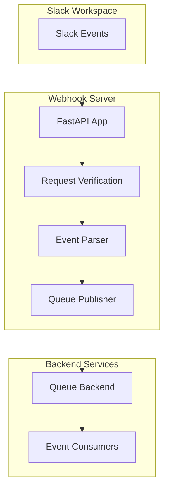
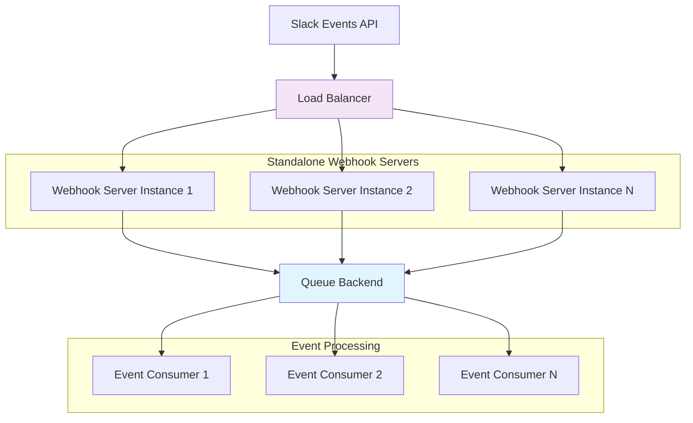
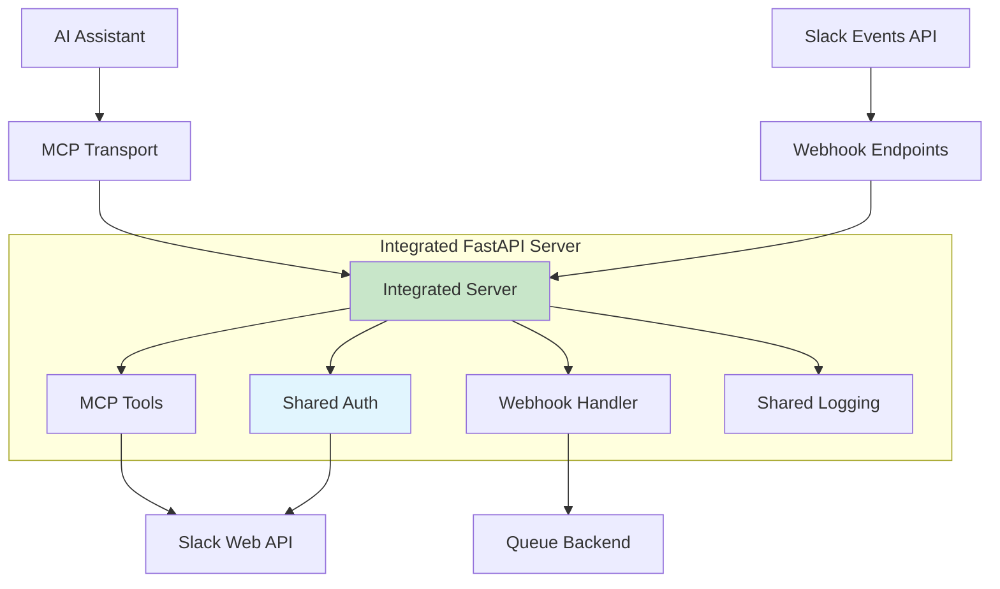
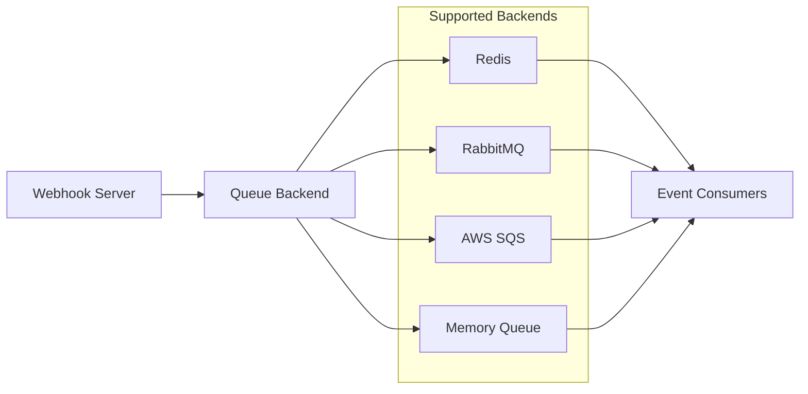
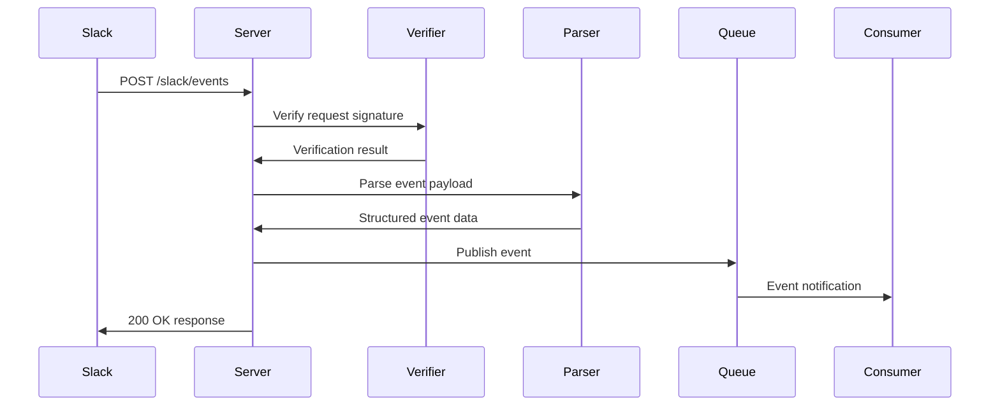

# Webhook Server Architecture

The Webhook Server is a FastAPI-based component that receives and processes Slack events through HTTP webhooks. This document provides comprehensive architectural coverage including security implementation, verification processes, deployment patterns, and system design.

## Overview

:::info Common Instance Management
The Webhook Server uses the **common instance management design** shared across all server types in this project. For detailed information about factory patterns, singleton management, token handling, and testing support, see the [Common Instance Management](./instance-management-design.mdx) documentation.
:::

The Webhook Server provides a secure, scalable endpoint for receiving Slack events with enterprise-grade security and reliability. It implements multi-layer security verification, event parsing with Pydantic models, and asynchronous publishing to configurable queue backends. The server supports both standalone and integrated deployment modes with comprehensive monitoring and error handling.



## Security Architecture

The webhook server implements enterprise-grade security with multiple layers of protection against unauthorized access, replay attacks, and request forgery.

### **Multi-Layer Security Model**

Security is implemented at multiple layers:

1. **🔐 Signature Verification** - HMAC-SHA256 verification of all incoming requests
2. **🛡️ Environment Security** - Secure management of secrets and tokens
3. **⏱️ Timestamp Validation** - Protection against replay attacks
4. **🚨 Request Validation** - Comprehensive payload and header validation
5. **📝 Audit Logging** - Detailed logging of security events

```mermaid
graph TD
    A[Incoming Request] --> B[Extract Headers]
    B --> C[Get X-Slack-Signature]
    B --> D[Get X-Slack-Request-Timestamp]
    B --> E[Get Request Body]
    
    C --> F[Parse Signature]
    D --> G[Validate Timestamp]
    E --> H[Read Body String]
    
    F --> I[Calculate Expected Signature]
    G --> I
    H --> I
    
    I --> J{Compare Signatures}
    J -->|Match| K[✅ Request Verified]
    J -->|No Match| L[❌ Request Rejected]
    
    G --> M{Timestamp Valid?}
    M -->|Too Old| N[❌ Request Rejected - Replay Attack]
    M -->|Valid| I
    
    style K fill:#c8e6c9
    style L fill:#ffcdd2
    style N fill:#ffcdd2
```



### **HMAC-SHA256 Signature Verification**

Slack signs every request using your app's signing secret with HMAC-SHA256 to ensure authenticity.

#### **Signature Algorithm**
```python
# Pseudo-code for signature generation (Slack side)
timestamp = current_unix_timestamp()
body = request_body_as_string
basestring = f"v0:{timestamp}:{body}"
signature = f"v0={hmac_sha256(signing_secret, basestring)}"
```

#### **Server Implementation**
```python
from slack_sdk.signature import SignatureVerifier

async def verify_slack_request(request: Request, signing_secret: str | None = None) -> bool:
    """Verify that the request is coming from Slack."""
    
    if signing_secret is None:
        signing_secret = os.environ.get("SLACK_SIGNING_SECRET", "")
        if not signing_secret:
            _LOG.error("SLACK_SIGNING_SECRET not set in environment")
            return False

    verifier = SignatureVerifier(signing_secret)

    # Get request headers and body
    signature = request.headers.get("X-Slack-Signature", "")
    timestamp = request.headers.get("X-Slack-Request-Timestamp", "")
    
    # Read the body
    body = await request.body()
    body_str = body.decode("utf-8")

    # Verify the request
    return verifier.is_valid(signature=signature, timestamp=timestamp, body=body_str)
```

### **Required Security Headers**

| Header | Format | Description |
|--------|--------|-------------|
| `X-Slack-Signature` | `v0=<signature>` | HMAC-SHA256 signature of the request |
| `X-Slack-Request-Timestamp` | `<unix_timestamp>` | Unix timestamp when the request was created |
| `Content-Type` | `application/json` | Request content type |

### **Replay Attack Protection**

Timestamp validation prevents replay attacks by rejecting requests older than 5 minutes:

```python
def validate_timestamp(timestamp: str, tolerance_seconds: int = 300) -> bool:
    """Validate request timestamp to prevent replay attacks"""
    try:
        request_time = int(timestamp)
        current_time = int(time.time())
        age = abs(current_time - request_time)
        return age <= tolerance_seconds
    except (ValueError, TypeError):
        return False
```

### **Environment-Based Secret Management**

```python
import os
from typing import Optional

class SecurityConfig:
    """Centralized security configuration"""
    
    def __init__(self):
        self.signing_secret = self._get_required_env("SLACK_SIGNING_SECRET")
        self.bot_token = self._get_required_env("SLACK_BOT_TOKEN")
        self.timestamp_tolerance = int(os.getenv("TIMESTAMP_TOLERANCE", "300"))
        
    def _get_required_env(self, key: str) -> str:
        value = os.getenv(key)
        if not value:
            raise ValueError(f"Required environment variable {key} not set")
        return value
```

**Security Best Practices:**
- Never log or expose signing secrets
- Use environment variables for all secrets
- Implement proper secret rotation procedures
- Monitor for invalid signature attempts
- Use HTTPS in production environments

## Deployment Architecture

The webhook server supports two primary deployment patterns, each optimized for different use cases and architectural requirements.

### **Deployment Modes**

#### **Standalone Mode**
Focused webhook-only deployment for microservices architectures:



**Characteristics:**
- **Lightweight**: Minimal resource footprint
- **Scalable**: Easy horizontal scaling
- **Focused**: Single responsibility (webhook processing)
- **Queue-first**: Immediate event publishing for asynchronous processing

#### **Integrated Mode**
Unified MCP + webhook server for complete Slack integration:



**Characteristics:**
- **Unified**: Single server for MCP + webhook functionality
- **Transport options**: SSE and HTTP streaming support
- **Shared resources**: Common authentication and configuration
- **Complete integration**: Full Slack capabilities in one deployment

### **Container Deployment Patterns**

#### **Docker Configuration**
```dockerfile
FROM python:3.11-slim

WORKDIR /app
COPY requirements.txt .
RUN pip install -r requirements.txt

COPY . .
EXPOSE 8080

# Standalone mode
CMD ["python", "-m", "slack_mcp.webhook", \
     "--host", "0.0.0.0", \
     "--port", "8080", \
     "--log-level", "INFO"]

# Integrated mode alternative
# CMD ["python", "-m", "slack_mcp.webhook", \
#      "--integrated", \
#      "--host", "0.0.0.0", \
#      "--port", "8080"]
```

#### **Docker Compose Architecture**
```yaml
version: '3.8'

services:
  slack-webhook:
    build: .
    ports:
      - "8080:8080"
    environment:
      - SLACK_SIGNING_SECRET=${SLACK_SIGNING_SECRET}
      - SLACK_BOT_TOKEN=${SLACK_BOT_TOKEN}
      - REDIS_URL=redis://redis:6379/0
    depends_on:
      - redis
    restart: unless-stopped
    
  redis:
    image: redis:7-alpine
    restart: unless-stopped
    
  event-processor:
    build: .
    command: python -m your_app.event_processor
    environment:
      - REDIS_URL=redis://redis:6379/0
    depends_on:
      - redis
    restart: unless-stopped
```

### **Kubernetes Deployment Architecture**

#### **Production Deployment Manifest**
```yaml
apiVersion: apps/v1
kind: Deployment
metadata:
  name: slack-webhook
  labels:
    app: slack-webhook
spec:
  replicas: 3
  selector:
    matchLabels:
      app: slack-webhook
  template:
    metadata:
      labels:
        app: slack-webhook
    spec:
      containers:
      - name: webhook
        image: slack-webhook:latest
        ports:
        - containerPort: 8080
        env:
        - name: SLACK_SIGNING_SECRET
          valueFrom:
            secretKeyRef:
              name: slack-secrets
              key: signing-secret
        - name: SLACK_BOT_TOKEN
          valueFrom:
            secretKeyRef:
              name: slack-secrets  
              key: bot-token
        resources:
          requests:
            memory: "128Mi"
            cpu: "100m"
          limits:
            memory: "256Mi"
            cpu: "200m"
        livenessProbe:
          httpGet:
            path: /
            port: 8080
          initialDelaySeconds: 30
          periodSeconds: 30
        readinessProbe:
          httpGet:
            path: /
            port: 8080
          initialDelaySeconds: 5
          periodSeconds: 10
```

### **Cloud Platform Deployments**

#### **Heroku**
```bash
# Procfile
web: python -m slack_mcp.webhook --host 0.0.0.0 --port $PORT --no-env-file

# Deploy commands
heroku create slack-webhook-app
heroku config:set SLACK_SIGNING_SECRET="your_secret"
heroku config:set SLACK_BOT_TOKEN="your_token"
git push heroku main
```

#### **Google Cloud Run**
```yaml
apiVersion: serving.knative.dev/v1
kind: Service
metadata:
  name: slack-webhook
spec:
  template:
    metadata:
      annotations:
        autoscaling.knative.dev/maxScale: "10"
    spec:
      containers:
      - image: gcr.io/PROJECT_ID/slack-webhook
        ports:
        - containerPort: 8080
        env:
        - name: SLACK_SIGNING_SECRET
          valueFrom:
            secretKeyRef:
              name: slack-secrets
              key: signing-secret
        resources:
          limits:
            cpu: "1"
            memory: "512Mi"
```

#### **AWS ECS Fargate**
```json
{
  "family": "slack-webhook",
  "networkMode": "awsvpc",
  "requiresCompatibilities": ["FARGATE"],
  "cpu": "256",
  "memory": "512",
  "containerDefinitions": [
    {
      "name": "webhook",
      "image": "ACCOUNT.dkr.ecr.REGION.amazonaws.com/slack-webhook:latest",
      "portMappings": [
        {
          "containerPort": 8080,
          "protocol": "tcp"
        }
      ],
      "environment": [
        {
          "name": "SLACK_SIGNING_SECRET",
          "value": "your_secret"
        }
      ]
    }
  ]
}
```

### **Scaling and Performance Architecture**

#### **Horizontal Scaling**
```bash
# Load balancer configuration
upstream slack_webhook {
    server webhook-1:8080;
    server webhook-2:8080;
    server webhook-3:8080;
}

server {
    listen 80;
    location / {
        proxy_pass http://slack_webhook;
        proxy_set_header Host $host;
        proxy_set_header X-Real-IP $remote_addr;
    }
}
```

#### **Resource Optimization**
- **Memory**: 128Mi-256Mi per instance (standalone), 256Mi-512Mi (integrated)
- **CPU**: 100m-200m per instance for typical workloads
- **Network**: Configure connection pooling for queue backends
- **Storage**: Stateless design requires no persistent storage

### **Queue Backend Architecture**

The webhook server integrates with various queue backends for event processing:



:::tip Custom Queue Backend Plugin Development
To develop custom queue backend plugins, use the **[Slack MCP Server Backend MQ Template](https://github.com/Chisanan232/Slack-MCP-Server-Backend-MQ-Template)**. This template repository provides a complete project structure with best practices, automated CI/CD workflows, and comprehensive documentation to accelerate your plugin development.

📚 **Template Documentation**: [https://chisanan232.github.io/Slack-MCP-Server-Backend-MQ-Template/](https://chisanan232.github.io/Slack-MCP-Server-Backend-MQ-Template/)

For detailed information on implementing the `QueueBackend` protocol and plugin registration, see [Event Handler & Queue Architecture](./event-handler-queue-architecture.mdx#developing-custom-queue-backends).
:::

**Redis Configuration:**
```bash
export QUEUE_BACKEND_TYPE="redis"
export REDIS_URL="redis://localhost:6379/0"
export REDIS_MAX_CONNECTIONS="50"
```

**Configuration Patterns:**
- **Development**: In-memory queue for testing
- **Production**: Redis or cloud-managed queues
- **High-volume**: Dedicated queue clusters with replication

### **Transport Architecture (Integrated Mode)**

#### **Server-Sent Events (SSE)**
```bash
# SSE transport configuration
python -m slack_mcp.webhook \
  --integrated \
  --mcp-transport sse \
  --mcp-mount-path /api/mcp
```

**Endpoints:**
- `GET /mcp` - SSE connection endpoint
- `POST /mcp` - Optional HTTP request endpoint

#### **HTTP Streaming**
```bash
# HTTP streaming transport
python -m slack_mcp.webhook \
  --integrated \
  --mcp-transport streamable-http
```

**Endpoints:**
- `POST /` - Streaming HTTP endpoint

## Core Components

### **FastAPI Application (`server.py`)**

The main webhook server implementation using FastAPI:

```python
from fastapi import FastAPI, Request, HTTPException
from slack_mcp.webhook.server import create_slack_app

app = create_slack_app()
```

**Key Features:**
- High-performance async HTTP server
- Automatic request/response validation
- Built-in OpenAPI documentation
- Comprehensive error handling
- Health check endpoints

### **Request Verification**

Security implementation for Slack request verification:

```python
async def verify_slack_request(request: Request, body: bytes) -> bool:
    signature = request.headers.get("x-slack-signature")
    timestamp = request.headers.get("x-slack-request-timestamp")
    
    # Verify signature using HMAC-SHA256
    expected_signature = create_signature(timestamp, body)
    return hmac.compare_digest(signature, expected_signature)
```

**Security Features:**
- HMAC-SHA256 signature verification
- Timestamp validation to prevent replay attacks
- Environment-based secret management
- Request body integrity checking

### **Event Processing Pipeline**



## API Endpoints

### **POST /slack/events**

Primary webhook endpoint for receiving Slack events:

**Request Headers:**
- `x-slack-signature`: HMAC-SHA256 signature
- `x-slack-request-timestamp`: Unix timestamp
- `content-type`: application/json

**Request Body:**
```json
{
  "token": "verification_token",
  "team_id": "T1234567890",
  "api_app_id": "A1234567890",
  "event": {
    "type": "message",
    "channel": "C1234567890",
    "user": "U1234567890",
    "text": "Hello, world!",
    "ts": "1234567890.123456"
  },
  "type": "event_callback",
  "event_id": "Ev1234567890",
  "event_time": 1234567890
}
```

**Response:**
- `200 OK`: Event processed successfully
- `400 Bad Request`: Invalid request format
- `401 Unauthorized`: Invalid signature
- `500 Internal Server Error`: Processing error

### **URL Verification Challenge**

Handles Slack's URL verification challenge:

```python
@app.post("/slack/events")
async def slack_events(request: Request):
    body = await request.body()
    data = json.loads(body)
    
    # Handle URL verification challenge
    if data.get("type") == "url_verification":
        return {"challenge": data["challenge"]}
```

### **Health Check Endpoints**

Server health and status monitoring:

- `GET /health`: Basic health check
- `GET /health/detailed`: Detailed status including queue connectivity

## Event Processing

### **Supported Event Types**

The webhook server processes various Slack event types:

- **Message Events**: `message`, `message.channels`, `message.groups`
- **User Events**: `user_change`, `team_join`
- **Channel Events**: `channel_created`, `channel_deleted`, `channel_rename`
- **Reaction Events**: `reaction_added`, `reaction_removed`
- **App Events**: `app_mention`, `app_home_opened`

### **Event Parsing and Validation**

Pydantic models for event validation:

```python
from pydantic import BaseModel
from typing import Optional, Dict, Any

class SlackEventModel(BaseModel):
    token: str
    team_id: str
    api_app_id: str
    event: Dict[str, Any]
    type: str
    event_id: str
    event_time: int
    
class UrlVerificationModel(BaseModel):
    token: str
    challenge: str
    type: str
```

### **Queue Integration**

Event publishing to backend queues:

```python
from slack_mcp.backends.queue import get_backend

async def publish_event(event_data: dict):
    backend = get_backend()
    topic = os.getenv("SLACK_EVENTS_TOPIC", "slack.events")
    await backend.publish(topic, event_data)
```

## Configuration

### **Environment Variables**

- `SLACK_SIGNING_SECRET`: Slack app signing secret for verification
- `SLACK_EVENTS_TOPIC`: Queue topic for published events
- `QUEUE_BACKEND_TYPE`: Queue backend selection (redis, memory, etc.)
- `HOST`: Server bind address (default: 0.0.0.0)
- `PORT`: Server port (default: 3000)
- `LOG_LEVEL`: Logging verbosity

### **CLI Configuration**

```bash
slack-webhook-server \
  --host 0.0.0.0 \
  --port 3000 \
  --log-level INFO \
  --retry 3
```

## Deployment Patterns

### **Standalone Mode**

Independent webhook server deployment:

```python
from slack_mcp.webhook.entry import run_webhook_server

# Run standalone webhook server
run_webhook_server(
    host="0.0.0.0",
    port=3000,
    retry=3
)
```

**Use Cases:**
- Microservices architecture
- Dedicated event processing services
- Horizontal scaling of webhook handling
- Integration with external event consumers

### **Docker Deployment**

Containerized webhook server:

```dockerfile
FROM python:3.11-slim
COPY . /app
WORKDIR /app
RUN pip install -e .
EXPOSE 3000
CMD ["slack-webhook-server", "--host", "0.0.0.0", "--port", "3000"]
```

### **Cloud Deployment**

Deployment to cloud platforms:

- **Heroku**: Direct deployment with environment variables
- **AWS Lambda**: Serverless webhook processing
- **Google Cloud Run**: Containerized serverless deployment
- **Kubernetes**: Scalable container orchestration

## Security Considerations

### **Request Security**

- **Signature Verification**: All requests verified using HMAC-SHA256
- **Timestamp Validation**: Prevents replay attacks
- **Secret Management**: Environment-based secret storage
- **HTTPS Enforcement**: TLS encryption for production

### **Input Validation**

- **Pydantic Models**: Automatic request validation
- **Type Checking**: Strict type enforcement
- **Sanitization**: Input sanitization and escaping
- **Rate Limiting**: Optional rate limiting implementation

### **Error Handling**

```python
@app.exception_handler(ValueError)
async def validation_exception_handler(request: Request, exc: ValueError):
    return JSONResponse(
        status_code=400,
        content={"error": "Invalid request format", "detail": str(exc)}
    )
```

## Performance Optimization

### **Async Processing**

- Full async/await implementation
- Non-blocking request handling
- Efficient resource utilization
- Concurrent request processing

### **Connection Management**

- HTTP connection pooling
- Persistent queue connections
- Resource cleanup and lifecycle management
- Memory-efficient event processing

### **Monitoring and Metrics**

- Request/response timing
- Event processing throughput
- Error rate tracking
- Queue health monitoring

## Error Handling and Recovery

### **Error Categories**

- **Verification Errors**: Invalid signatures or timestamps
- **Parsing Errors**: Malformed event payloads
- **Queue Errors**: Backend publishing failures
- **Network Errors**: Connection issues

### **Retry Logic**

```python
async def publish_with_retry(event_data: dict, max_retries: int = 3):
    for attempt in range(max_retries):
        try:
            await backend.publish(topic, event_data)
            return
        except Exception as e:
            if attempt == max_retries - 1:
                logger.error(f"Failed to publish after {max_retries} attempts")
                raise
            await asyncio.sleep(2 ** attempt)  # Exponential backoff
```

## Testing Strategy

### **Unit Testing**

- Request verification testing
- Event parsing validation
- Queue integration mocking
- Error handling scenarios

### **Integration Testing**

- End-to-end webhook flow
- Queue backend integration
- Slack event simulation
- Security verification testing

This webhook server architecture provides a robust, secure, and scalable foundation for processing Slack events while maintaining flexibility for various deployment scenarios and integration patterns.
