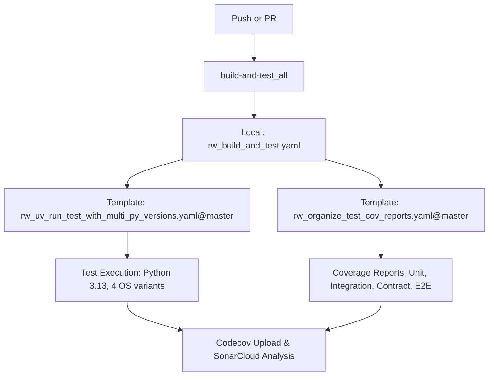

# Continuous Integration

This document covers the Continuous Integration (CI) workflows used to maintain code quality and ensure tests pass in the Slack MCP Server project.

## Status Badges

[](https://github.com/Chisanan232/slack-mcp-server/actions/workflows/ci.yaml)
[](https://github.com/Chisanan232/slack-mcp-server/actions/workflows/ci_includes_e2e_test.yaml)

## Workflow Triggers

Our CI workflow ([`ci.yaml`](https://github.com/Chisanan232/slack-mcp-server/blob/master/.github/workflows/ci.yaml)) is triggered on:

- **Push to master branch**: Excluding branches with "e2e" in their name
- **Pull requests to master**: Excluding branches with "e2e" in their name
- Only when specific paths are modified:
  - GitHub Actions workflow files
  - Python source code (`slack_mcp/**/*.py`)
  - Test files (`test/**/*.py`)
  - Test configuration files ([`.coveragerc`](https://github.com/Chisanan232/slack-mcp-server/blob/master/.coveragerc), [`pytest.ini`](https://github.com/Chisanan232/slack-mcp-server/blob/master/pytest.ini), etc.)
  - Project configuration ([`pyproject.toml`](https://github.com/Chisanan232/slack-mcp-server/blob/master/pyproject.toml), [`uv.lock`](https://github.com/Chisanan232/slack-mcp-server/blob/master/uv.lock))

## Template Repository Architecture

The CI system now leverages a **template repository architecture** using workflows from [`Chisanan232/Template-Python-UV-Project`](https://github.com/Chisanan232/Template-Python-UV-Project):

:::info Template Project Resources

**🏛️ Repository**: [`Chisanan232/Template-Python-UV-Project`](https://github.com/Chisanan232/Template-Python-UV-Project)  
**📖 Documentation**: [Template Project CI/CD Guide](https://chisanan232.github.io/Template-Python-UV-Project/dev/next/ci-cd)  
**⚙️ Workflow Directory**: [`/.github/workflows/`](https://github.com/Chisanan232/Template-Python-UV-Project/tree/master/.github/workflows)

**💡 About the Template Project**: The Template-Python-UV-Project provides a comprehensive set of reusable GitHub Actions workflows specifically designed for Python projects using the UV package manager. It includes standardized workflows for testing, coverage reporting, release management, and documentation deployment.

:::



## Current CI Architecture

### **🏠 Local Orchestration Workflows**
- **[`ci.yaml`](https://github.com/Chisanan232/slack-mcp-server/blob/master/.github/workflows/ci.yaml)** - Main CI pipeline
- **[`rw_run_all_test_and_record.yaml`](https://github.com/Chisanan232/slack-mcp-server/blob/master/.github/workflows/rw_run_all_test_and_record.yaml)** - Test coordination
- **[`rw_build_and_test.yaml`](https://github.com/Chisanan232/slack-mcp-server/blob/master/.github/workflows/rw_build_and_test.yaml)** - Test orchestration

### **☁️ Template Repository Workflows**
- **Multi-Python Testing**: [`rw_uv_run_test_with_multi_py_versions.yaml`](https://github.com/Chisanan232/Template-Python-UV-Project/blob/master/.github/workflows/rw_uv_run_test_with_multi_py_versions.yaml) - Comprehensive testing across multiple Python versions and operating systems
- **Coverage Organization**: [`rw_organize_test_cov_reports.yaml`](https://github.com/Chisanan232/Template-Python-UV-Project/blob/master/.github/workflows/rw_organize_test_cov_reports.yaml) - Standardized test coverage reporting and organization

:::tip Learn More
For detailed information about all available template workflows, visit the [Template Project CI/CD Documentation](https://chisanan232.github.io/Template-Python-UV-Project/dev/next/ci-cd)
:::

## Main CI Workflow Steps

### 1. Local Build and Test Orchestration ([`rw_build_and_test.yaml`](https://github.com/Chisanan232/slack-mcp-server/blob/master/.github/workflows/rw_build_and_test.yaml))

**Architecture**: Local orchestrator using template repository workflows

**Configuration**:
- **Python Version**: 3.13 (hardcoded for consistency)
- **Operating Systems**: `["ubuntu-latest", "ubuntu-22.04", "macos-latest", "macos-14"]`
- **Test Types**: Unit, Integration, Contract, E2E (conditional), CI Scripts

**Template Integration**:
```yaml
jobs:
  run_unit-test:
    uses: Chisanan232/Template-Python-UV-Project/.github/workflows/rw_uv_run_test_with_multi_py_versions.yaml@master
    with:
      test_type: unit-test
      python-versions: '["3.13"]'
      operating-systems: '["ubuntu-latest", "ubuntu-22.04", "macos-latest", "macos-14"]'
```

> 📋 **Template Workflow Reference**: [`rw_uv_run_test_with_multi_py_versions.yaml`](https://github.com/Chisanan232/Template-Python-UV-Project/blob/master/.github/workflows/rw_uv_run_test_with_multi_py_versions.yaml)

### 2. Template Repository Coverage Organization

Each test type uses the template repository's standardized coverage workflow:

```yaml
unit-test_codecov:
  uses: Chisanan232/Template-Python-UV-Project/.github/workflows/rw_organize_test_cov_reports.yaml@master
  with:
    test_type: unit-test
```

> 📋 **Template Workflow Reference**: [`rw_organize_test_cov_reports.yaml`](https://github.com/Chisanan232/Template-Python-UV-Project/blob/master/.github/workflows/rw_organize_test_cov_reports.yaml)

**Template Repository Benefits**:
- ✅ **Standardized Processing**: Consistent coverage report generation across all template-based projects
- ✅ **Automatic Updates**: Bug fixes and improvements flow automatically from template repository
- ✅ **Multi-Format Support**: Generates XML, HTML, and JSON coverage reports
- ✅ **Artifact Management**: Organizes coverage files with consistent naming patterns
- ✅ **Community Maintained**: Open-source template with active development and community contributions
- ✅ **Comprehensive Documentation**: Detailed guides available at [Template Project Docs](https://chisanan232.github.io/Template-Python-UV-Project/dev/next/ci-cd)

### 3. Configuration Strategy

**Hardcoded Configuration Rationale**:
The project uses **hardcoded configuration** for consistency and reliability:

```yaml
# Consistent across all test jobs
python-versions: '["3.13"]'
operating-systems: '["ubuntu-latest", "ubuntu-22.04", "macos-latest", "macos-14"]'
```

**Benefits of Hardcoded Configuration**:
- 🎯 **Predictable Testing**: Consistent test matrix across all CI runs
- 🔧 **Simplified Maintenance**: No parameter passing complexity
- 🚀 **Reliable Results**: Same environment combinations every time
- 📊 **Matrix Coverage**: Tests across 4 OS variants with latest Python

### 4. Code Quality Checks

As part of the test process, the following checks are performed:
- **MyPy**: Type checking
- **PyLint**: Code analysis based on Google's Python style guide
- **Flake8**: PEP 8 compliance checking
- **Black**: Code formatting verification
- **isort**: Import sorting verification

## Multi-Python Version Testing

The project uses a dedicated workflow from the template repository ([`rw_uv_run_test_with_multi_py_versions.yaml`](https://github.com/Chisanan232/Template-Python-UV-Project/blob/master/.github/workflows/rw_uv_run_test_with_multi_py_versions.yaml)) to test across multiple Python versions, ensuring compatibility.

---

## Navigation

- **🏠 [CI/CD Overview](/dev/next/ci-cd)** - Return to main CI/CD hub
- **🔄 [Release System](./release-system)** - Learn about releases and deployment
- **⚙️ [Additional CI Workflows](./additional-ci-workflows)** - Specialized utility workflows
- **🛠️ [Developer Guide](./developer-guide)** - Configuration and troubleshooting
